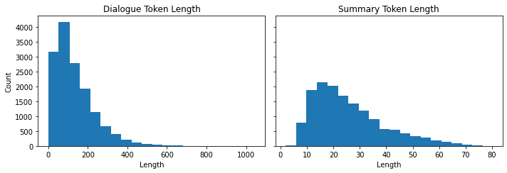

* [Introduction](#introduction)
* [Project: Summarize Dialogues Between Several People](#project-summarize-dialogues-between-several-people)
* [The CNN/DailyMail Dataset](#the-cnn/dailymail-dataset)
* [Text Summarization Pipelines](#text-summarization-pipelines)
* [Comparing Different Summaries](#comparing-different-summaries)
* [Measuring the Quality of Generated Text](#measuring-the-quality-of-generated-text)
* [Evaluating PEGASUS on the CNN/DailyMail Dataset](#evaluating-pegasus-on-the-cnndailymail-dataset)
* [Training a Summarization Model](#training-a-summarization-model)
* [Conclusion](#conclusion)
* [References](#references)


------

**Note:** Had to update the `datasets` package to version 2.0.0.


```python
import transformers
import datasets
import accelerate

# Only print error messages
transformers.logging.set_verbosity_error()
datasets.logging.set_verbosity_error()

transformers.__version__, datasets.__version__, accelerate.__version__
```
```text
    ('4.11.3', '2.0.0', '0.5.1')
```

------

```python
from transformers import pipeline, set_seed
```


```python
import ast
# https://astor.readthedocs.io/en/latest/
import astor
import inspect
import textwrap
def print_source(obj, exclude_doc=True):
    
    # Get source code
    source = inspect.getsource(obj)
    # Remove any common leading whitespace from every line
    cleaned_source = textwrap.dedent(source)
    # Parse the source into an AST node.
    parsed = ast.parse(cleaned_source)

    for node in ast.walk(parsed):
        # Skip any nodes that are not class or function definitions
        if not isinstance(node, (ast.FunctionDef, ast.ClassDef, ast.AsyncFunctionDef)):
            continue
        
        if exclude_doc and len(node.body) > 1: node.body = node.body[1:]
        
    print(astor.to_source(parsed))
```

------


## Introduction

* Text summarization requires the model to understand long passages, reason about the contents, and produce fluent text that incorporates the main topics from the original document.


## Project: Summarize Dialogues Between Several People

* Text summarization requires the model to understand long passages, reason about the contents, and produce fluent text that incorporates the main topics from the original document.
* Text summarization is a classic sequence-to-sequence task with an input text and a target text.
* The goal is to build an encoder-decoder model to condense dialogues between several people into a crisp summary.


## The CNN/DailyMail Dataset

* The CNN/DailyMail dataset contains over 300,000 pairs of news articles and their corresponding summaries.
* The summaries are composed of the bullet points that CNN and The Daily Mail attach to their articles.
* The summaries are abstractive, consisting of new sentences instead of excerpts.
* [GitHub Repository](https://github.com/abisee/cnn-dailymail)
* [Hugging Face Dataset Card](https://huggingface.co/datasets/cnn_dailymail)

------


```python
from datasets import load_dataset
```

------

**Load Version 3.0.0 of the CNN/DailMail dataset**

```python
dataset = load_dataset("cnn_dailymail", version="3.0.0")
print(f"Features: {dataset['train'].column_names}")
```
```text
    Features: ['article', 'highlights', 'id']
```

**Note:**

* The dataset has three columns.
    1. The `article` column contains the news articles.
    2. The `highlights` column contains the summaries.
    3. The `ids` column uniquely identifies each article.

------

**View an excerpt from an article**

```python
sample = dataset["train"][1]
article_len = len(sample["article"])
highlights_len = len(sample["highlights"])
print(f"""
Article (excerpt of 500 characters, total length: {article_len}):
""")
print(sample["article"][:500])
print(f'\nSummary (length: {highlights_len}):')
print(sample["highlights"])
print(f'\nThe article is {(article_len/highlights_len):.2f} times longer than the summary.')
```
```text

    Article (excerpt of 500 characters, total length: 3192):
    
    (CNN) -- Usain Bolt rounded off the world championships Sunday by claiming his third gold in Moscow as he anchored Jamaica to victory in the men's 4x100m relay. The fastest man in the world charged clear of United States rival Justin Gatlin as the Jamaican quartet of Nesta Carter, Kemar Bailey-Cole, Nickel Ashmeade and Bolt won in 37.36 seconds. The U.S finished second in 37.56 seconds with Canada taking the bronze after Britain were disqualified for a faulty handover. The 26-year-old Bolt has n
    
    Summary (length: 180):
    Usain Bolt wins third gold of world championship .
    Anchors Jamaica to 4x100m relay victory .
    Eighth gold at the championships for Bolt .
    Jamaica double up in women's 4x100m relay .
    
    The article is 17.73 times longer than the summary.
```

**Note:** 
* Articles can be very long compared to the target summary.
* Long articles are challenging for most transformer models as their context size usually maxes out around 1,000 tokens.
    * A thousand tokens can contain a few paragraphs of text.
* The standard workaround to this limitation is to truncate the text to the model's context size.
    * This approach risks losing important information in the excluded portion of the text.

------


## Text Summarization Pipelines

**Get a 2,000 character excerpt from an article**

```python
sample_text = dataset["train"][1]["article"][:2000]
# We'll collect the generated summaries of each model in a dictionary
summaries = {}
```

**Note:** It is a convention in summarization to separate sentences by a newline.

------


```python
import nltk
from nltk.tokenize import sent_tokenize
```

------

#### The Natural Language Tookit (NLTK)

* [Homepage](https://www.nltk.org/)
* The toolkit provides easy-to-use interfaces and a suite of text processing libraries.


#### `sent_tokenize`
* [Documentation](https://www.nltk.org/api/nltk.tokenize.html?highlight=sent_tokenize#nltk.tokenize.sent_tokenize)
* Get a sentence-tokenized copy of a text.

### `nltk.tokenize.punkt`
* [Documentation](https://www.nltk.org/api/nltk.tokenize.punkt.html?highlight=punkt#module-nltk.tokenize.punkt)
* The Punkt sentence tokenizer divides a text into a list of sentences. 
* An unsupervised algorithm builds a model of abbreviation words, collocations, and words that start sentences.

**Download the Punkt package**

```python
nltk.download("punkt")
```
```text
    [nltk_data] Downloading package punkt to /home/innom-dt/nltk_data...
    [nltk_data]   Package punkt is already up-to-date!

    True
```

------

**Test the sentence tokenizer**

```python
string = "The U.S. are a country. The U.N. is an organization."
sent_tokenize(string)
```
```text
    ['The U.S. are a country.', 'The U.N. is an organization.']
```

------

### Summarization Baseline

* A common baseline for summarizing news articles is to take the first three sentences of the article.

**Define a function to extract the first three sentences from a text**

```python
def three_sentence_summary(text):
    return "\n".join(sent_tokenize(text)[:3])
```

------

**Create a baseline summary**

```python
summaries["baseline"] = three_sentence_summary(sample_text)
```

------

**Set device number for Hugging Face Pipelines**

```python
import torch
```


```python
# 0 for the first CUDA GPU
# -1 for CPU
device_num = 0 if torch.cuda.is_available() else -1
```

------

### GPT-2

* We can use the GPT-2 model to generate summaries by appending "TL;DR" to the end of the input text.
* TL;DR indicates a short version of a long post.

------


```python
from transformers import pipeline, set_seed
```

------

#### `TextGenerationPipeline`

* [Documentation](https://huggingface.co/docs/transformers/main/en/main_classes/pipelines#transformers.TextGenerationPipeline)
* Create a language generation pipeline that predicts the words that will follow a specified text prompt.

**Reset random seed**

```python
set_seed(42)
```

------

**Create a language generation pipeline using GPT-2**

```python
pipe = pipeline("text-generation", model="gpt2-xl", device=device_num)
type(pipe)
```
```text
    transformers.pipelines.text_generation.TextGenerationPipeline
```

------

**Create a summary with the GPT-2 model**

```python
gpt2_query = sample_text + "\nTL;DR:\n"
pipe_out = pipe(gpt2_query, max_length=512, clean_up_tokenization_spaces=True)
summaries["gpt2"] = "\n".join(
    sent_tokenize(pipe_out[0]["generated_text"][len(gpt2_query) :]))
```


```python
pipe_out[0]
```
```text
    {'generated_text': '(CNN) -- Usain Bolt rounded off the world championships Sunday by claiming his third gold in Moscow as he anchored Jamaica to victory in the men\'s 4x100m relay. The fastest man in the world charged clear of United States rival Justin Gatlin as the Jamaican quartet of Nesta Carter, Kemar Bailey-Cole, Nickel Ashmeade and Bolt won in 37.36 seconds. The U.S finished second in 37.56 seconds with Canada taking the bronze after Britain were disqualified for a faulty handover. The 26-year-old Bolt has now collected eight gold medals at world championships, equaling the record held by American trio Carl Lewis, Michael Johnson and Allyson Felix, not to mention the small matter of six Olympic titles. The relay triumph followed individual successes in the 100 and 200 meters in the Russian capital. "I\'m proud of myself and I\'ll continue to work to dominate for as long as possible," Bolt said, having previously expressed his intention to carry on until the 2016 Rio Olympics. Victory was never seriously in doubt once he got the baton safely in hand from Ashmeade, while Gatlin and the United States third leg runner Rakieem Salaam had problems. Gatlin strayed out of his lane as he struggled to get full control of their baton and was never able to get on terms with Bolt. Earlier, Jamaica\'s women underlined their dominance in the sprint events by winning the 4x100m relay gold, anchored by Shelly-Ann Fraser-Pryce, who like Bolt was completing a triple. Their quartet recorded a championship record of 41.29 seconds, well clear of France, who crossed the line in second place in 42.73 seconds. Defending champions, the United States, were initially back in the bronze medal position after losing time on the second handover between Alexandria Anderson and English Gardner, but promoted to silver when France were subsequently disqualified for an illegal handover. The British quartet, who were initially fourth, were promoted to the bronze which eluded their men\'s team. Fraser-Pryce, like Bolt ag\nTL;DR:\nThe World Championships have come to a close and Usain Bolt has been crowned world champion. The Jamaica sprinter ran a lap of the track at 20.52 seconds, faster than even the world\'s best sprinter from last year -- South Korea\'s Yuna Kim, whom Bolt outscored by 0.26 seconds. It\'s his third medal in succession at the championships: 2011, 2012 and'}
```

------

```python
summaries["gpt2"]
```
```text
    "The World Championships have come to a close and Usain Bolt has been crowned world champion.\nThe Jamaica sprinter ran a lap of the track at 20.52 seconds, faster than even the world's best sprinter from last year -- South Korea's Yuna Kim, whom Bolt outscored by 0.26 seconds.\nIt's his third medal in succession at the championships: 2011, 2012 and"
```

------


### T5
* We can perform several tasks using the text prompts from the training process.

#### Text-to-Text Prompts:
* **Translation:** "translate {source-language} to {target-languge}: {text}"
* **Linguistic Acceptability:** "cola sentence: {text}"
* **Semantic Similarity:** "stsb sentence 1: {text1} sentence 2: {text2}"
* **Summarization:** "summarize: {text}"

**Reset random seed**
```python
set_seed(42)
```

------

**Create a text generation pipeline with the T5 model**

```python
pipe = pipeline("summarization", model="t5-large", device=device_num)
```

------

**Create a summary with the T5 model**

```python
pipe_out = pipe(sample_text)
summaries["t5"] = "\n".join(sent_tokenize(pipe_out[0]["summary_text"]))
```

------


```python
summaries["t5"]
```
```text
    "usain bolt wins his third gold medal of the world championships in the men's 4x100m relay .\nthe 26-year-old anchored Jamaica to victory in the event in the Russian capital .\nhe has now collected eight gold medals at the championships, equaling the record ."
```

------


### BART

* The "facebook/bart-large-cnn" model checkpoint is fine-tuned specifically on the CNN/DailyMail dataset.

**Reset random seed**
```python
set_seed(42)
```

------

**Create a text generation pipeline with the BART model**

```python
pipe = pipeline("summarization", model="facebook/bart-large-cnn", device=device_num)
```

------

**Create a summary with the BART model**

```python
pipe_out = pipe(sample_text)
summaries["bart"] = "\n".join(sent_tokenize(pipe_out[0]["summary_text"]))
```

------


```python
summaries["bart"]
```
```text
    "Usain Bolt wins his third gold of the world championships in Moscow.\nBolt anchors Jamaica to victory in the men's 4x100m relay.\nThe 26-year-old has now won eight gold medals at world championships.\nJamaica's women also win gold in the relay, beating France in the process."
```

------


### PEGASUS

* [PEGASUS: Pre-training with Extracted Gap-sentences for Abstractive Summarization](https://arxiv.org/abs/1912.08777)
* PEGASUS is an encoder-decoder transformer trained to predict masked sentences in multisentence tests.
* The authors argue that the pretraining objective is more effective the closer is to the downstream task.
* The authors trained PEGASUS to reconstruct sentences containing most of the content of their surrounding paragraphs in a large corpus.
* The model has dedicated tokens for newlines, so we do not need the sent_tokenize function. 

**Reset random seed**
```python
set_seed(42)
```

------

**Create a text generation pipeline with the PEGASUS model**

```python
pipe = pipeline("summarization", model="google/pegasus-cnn_dailymail", device=device_num)
```

**Create a summary with the PEGASUS model**
```python
pipe_out = pipe(sample_text)
summaries["pegasus"] = pipe_out[0]["summary_text"].replace(" .<n>", ".\n")
```

------


```python
summaries["pegasus"]
```
```text
    "Usain Bolt wins third gold of world championships.\nAnchors Jamaica to victory in men's 4x100m relay.\nEighth gold at the championships for Bolt.\nJamaica also win women's 4x100m relay ."
```

------


## Comparing Different Summaries


```python
print("GROUND TRUTH")
print(dataset["train"][1]["highlights"])
print("")

for model_name in summaries:
    print(model_name.upper())
    print(summaries[model_name])
    print("")
```
```text
    GROUND TRUTH
    Usain Bolt wins third gold of world championship .
    Anchors Jamaica to 4x100m relay victory .
    Eighth gold at the championships for Bolt .
    Jamaica double up in women's 4x100m relay .
    
    BASELINE
    (CNN) -- Usain Bolt rounded off the world championships Sunday by claiming his third gold in Moscow as he anchored Jamaica to victory in the men's 4x100m relay.
    The fastest man in the world charged clear of United States rival Justin Gatlin as the Jamaican quartet of Nesta Carter, Kemar Bailey-Cole, Nickel Ashmeade and Bolt won in 37.36 seconds.
    The U.S finished second in 37.56 seconds with Canada taking the bronze after Britain were disqualified for a faulty handover.
    
    GPT2
    The World Championships have come to a close and Usain Bolt has been crowned world champion.
    The Jamaica sprinter ran a lap of the track at 20.52 seconds, faster than even the world's best sprinter from last year -- South Korea's Yuna Kim, whom Bolt outscored by 0.26 seconds.
    It's his third medal in succession at the championships: 2011, 2012 and
    
    T5
    usain bolt wins his third gold medal of the world championships in the men's 4x100m relay .
    the 26-year-old anchored Jamaica to victory in the event in the Russian capital .
    he has now collected eight gold medals at the championships, equaling the record .
    
    BART
    Usain Bolt wins his third gold of the world championships in Moscow.
    Bolt anchors Jamaica to victory in the men's 4x100m relay.
    The 26-year-old has now won eight gold medals at world championships.
    Jamaica's women also win gold in the relay, beating France in the process.
    
    PEGASUS
    Usain Bolt wins third gold of world championships.
    Anchors Jamaica to victory in men's 4x100m relay.
    Eighth gold at the championships for Bolt.
    Jamaica also win women's 4x100m relay .
```


**Note:**
* The summary generated by GPT-2 is quite different than the others.
* GPT-2 summarizes the characters instead of the text.
* The GPT-2 model often invents facts since it did not train to generate truthful summaries.
* There are significant similarities between the summaries generated by the T5, BART, and PEGASUS models.
* PEGASUS gets incredibly close to the ground truth summary.

------


## Measuring the Quality of Generated Text

* Conventional metrics like accuracy do not reflect the quality of the generated text.
* The field of text-generation is still looking for better evaluation metrics.
* The two most common metrics used to evaluate generated text are BLEU and ROUGE.
* Human judgment is still the best measure.

### Bilingual Evaluation Understudy (BLEU)
* [BLEU: a method for automatic evaluation of machine translation](https://dl.acm.org/doi/10.3115/1073083.1073135)
* BLEU is a precision-based metric where we count the number of words or n-grams in the generated text that occur in the reference text and divide it by the length of the reference.
* We only count a word as many times as it occurs in the reference text.
* BLEU is a popular metric for tasks like machine translation where precision takes priority. 
* Given one generated sentence, $snt$, that we to compare against a reference sentence, $snt^{\prime}$, we extract all possible n-grams of degree $n$ and do the accounting to get the precision $P_{n}$.

### $$P_{n} = \frac{\sum_{n-gram \ \in \ snt}{Count_{clip}(n-gram)}}{\sum_{n-gram \ \in \ snt^{\prime}}{Count(n-gram)}}$$
* We clip the occurrence count of an n-gram at how many times it appears in the reference sentence to avoid repetitive generations.
* We sum over all the examples in the corpus $C$.

### $$P_{n} = \frac{\sum_{snt \ \in \ C}\sum_{n-gram \ \in \ snt}{Count_{clip}(n-gram)}}{\sum_{snt^{\prime} \ \in \ C}\sum_{n-gram \ \in \ snt^{\prime}}{Count(n-gram)}}$$
* The precision score favors short sentences.
* The authors of BLEU introduce a brevity penalty to account for this.

### $$BR = min \left(1,e^{\frac{1 - \ell_{ref}}{\ell_{gen}}} \right)$$
* By taking the minimum, we ensure that this penalty never exceeds $1$, and the exponential term becomes exponentially small when the length of the generated text is smaller than the reference text.
* We don't use recall because it would incentivize translations that used all the words from all reference texts.
* The equation for the BLEU score:

### $$\text{BLEU-N} = BR \times \left( \prod^{N}_{n=1}{P_{n}} \right)^{\frac{1}{N}}$$
* The last term is the geometric mean of the modified precision up to n-gram $N$.
* The BLEU score does not account for synonyms and uses fragile heuristics.
* [Evaluating Text Output in NLP: BLEU at your own risk](https://towardsdatascience.com/evaluating-text-output-in-nlp-bleu-at-your-own-risk-e8609665a213)
    * This post provides an exposition of BLEU's flaws.
* The default BLEU metric expects tokenized text, leading to varying results for different tokenization methods.
* The SacreBLEU metric internalizes the tokenization step and is the preferred benchmarking metric.

------


```python
from datasets import load_metric
```

------

#### `load_metric`

* [Documentation](https://huggingface.co/docs/datasets/v2.0.0/en/package_reference/loading_methods#datasets.load_metric)
* Load a `datasets.Metric`

**Load the SacreBLEU metric**
```python
bleu_metric = load_metric("sacrebleu")
```

------


```python
bleu_metric.codebase_urls
```
```text
    ['https://github.com/mjpost/sacreBLEU']
```

------

```python
bleu_metric
```
```text
    Metric(name: "sacrebleu", features: {'predictions': Value(dtype='string', id='sequence'), 'references': Sequence(feature=Value(dtype='string', id='sequence'), length=-1, id='references')}, usage: """
    Produces BLEU scores along with its sufficient statistics
    from a source against one or more references.
    
    Args:
        predictions: The system stream (a sequence of segments).
        references: A list of one or more reference streams (each a sequence of segments).
        smooth_method: The smoothing method to use. (Default: 'exp').
        smooth_value: The smoothing value. Only valid for 'floor' and 'add-k'. (Defaults: floor: 0.1, add-k: 1).
        tokenize: Tokenization method to use for BLEU. If not provided, defaults to 'zh' for Chinese, 'ja-mecab' for
            Japanese and '13a' (mteval) otherwise.
        lowercase: Lowercase the data. If True, enables case-insensitivity. (Default: False).
        force: Insist that your tokenized input is actually detokenized.
    
    Returns:
        'score': BLEU score,
        'counts': Counts,
        'totals': Totals,
        'precisions': Precisions,
        'bp': Brevity penalty,
        'sys_len': predictions length,
        'ref_len': reference length,
    
    Examples:
    
        >>> predictions = ["hello there general kenobi", "foo bar foobar"]
        >>> references = [["hello there general kenobi", "hello there !"], ["foo bar foobar", "foo bar foobar"]]
        >>> sacrebleu = datasets.load_metric("sacrebleu")
        >>> results = sacrebleu.compute(predictions=predictions, references=references)
        >>> print(list(results.keys()))
        ['score', 'counts', 'totals', 'precisions', 'bp', 'sys_len', 'ref_len']
        >>> print(round(results["score"], 1))
        100.0
    """, stored examples: 0)
```

**Note:**

* The bleu_metric object is an instance of the [Metric](https://huggingface.co/docs/datasets/v2.0.0/en/package_reference/main_classes#datasets.Metric) class and works as an aggregator.
* Add single instances with the `add()` method or whole batches via `add_batch()`.
* Call the `compute()` method to calculate the metric.

------


```python
import pandas as pd
import numpy as np
```

------

**Add a single prediction and refernce to the metric's stack**

```python
bleu_metric.add(prediction="the the the the the the", reference=["the cat is on the mat"])
```

------

**Compute the metrics with very differnt sentences**

```python
results = bleu_metric.compute(smooth_method="floor", smooth_value=0)
results["precisions"] = [np.round(p, 2) for p in results["precisions"]]
pd.DataFrame.from_dict(results, orient="index", columns=["Value"])
```
<div style="overflow-x:auto;">
<table border="1" class="dataframe">
  <thead>
    <tr style="text-align: right;">
      <th></th>
      <th>Value</th>
    </tr>
  </thead>
  <tbody>
    <tr>
      <th>score</th>
      <td>0.0</td>
    </tr>
    <tr>
      <th>counts</th>
      <td>[2, 0, 0, 0]</td>
    </tr>
    <tr>
      <th>totals</th>
      <td>[6, 5, 4, 3]</td>
    </tr>
    <tr>
      <th>precisions</th>
      <td>[33.33, 0.0, 0.0, 0.0]</td>
    </tr>
    <tr>
      <th>bp</th>
      <td>1.0</td>
    </tr>
    <tr>
      <th>sys_len</th>
      <td>6</td>
    </tr>
    <tr>
      <th>ref_len</th>
      <td>6</td>
    </tr>
  </tbody>
</table>
</div>
**Note:** 

* The precision of the 1-gram is 2/6 since the word "the" appears twice in the reference text.
* The BLEU score also works if there are multiple reference translations.
* BLEU integrates methods to modify the precision calculation to make the metric smoother for zero counts in the n-grams.

------

**Compute the metrics with very similar sentences**
```python
bleu_metric.add(prediction="the cat is on mat", reference=["the cat is on the mat"])
results = bleu_metric.compute(smooth_method="floor", smooth_value=0)
results["precisions"] = [np.round(p, 2) for p in results["precisions"]]
pd.DataFrame.from_dict(results, orient="index", columns=["Value"])
```
<div style="overflow-x:auto;">
<table border="1" class="dataframe">
  <thead>
    <tr style="text-align: right;">
      <th></th>
      <th>Value</th>
    </tr>
  </thead>
  <tbody>
    <tr>
      <th>score</th>
      <td>57.893007</td>
    </tr>
    <tr>
      <th>counts</th>
      <td>[5, 3, 2, 1]</td>
    </tr>
    <tr>
      <th>totals</th>
      <td>[5, 4, 3, 2]</td>
    </tr>
    <tr>
      <th>precisions</th>
      <td>[100.0, 75.0, 66.67, 50.0]</td>
    </tr>
    <tr>
      <th>bp</th>
      <td>0.818731</td>
    </tr>
    <tr>
      <th>sys_len</th>
      <td>5</td>
    </tr>
    <tr>
      <th>ref_len</th>
      <td>6</td>
    </tr>
  </tbody>
</table>
</div>
**Note:** 

* The precision scores are much better.
* The 1-grams in the prediction all match.

------

### ROUGE

* [ROUGE: A Package for Automatic Evaluation of Summaries](https://aclanthology.org/W04-1013.pdf)
* The ROUGE score targets applications like summarization, where high recall is more important than precision alone.
* We check how many n-grams in the reference text also occur in the generated text.

### $$\text{ROUGE-N} = \frac{\sum_{snt^{\prime} \ \in \ C}\sum_{n-gram \ \in \ snt^{\prime}}{Count_{match}(n-gram)}}{\sum_{snt^{\prime} \ \in \ C}\sum_{n-gram \ \in \ snt^{\prime}}{Count(n-gram)}}$$
* There is a separate score to measure the longest common substring (LCS) called ROUGE-L.
* We can calculate the LCS for any pair of strings.
* We need to normalize the LCS value when comparing two samples of different lengths.

### $$F_{LCS} = \frac{\left( 1 + \beta^{2} \right)R_{LCS}P_{LCS}}{R_{LCS} + \beta P_{LCS}} \text{, where } \beta = \frac{P_{LCS}}{R_{LCS}}$$
* The Hugging Face Datasets implementation calculates two variants of ROUGE.
* ROUGE-L calculates the score per sentence and averages it for the summaries.
* ROUGE-Lsum calculates the score per sentence directly over the whole summary.

------


```python
rouge_metric = load_metric("rouge")
```

------


```python
rouge_metric.codebase_urls
```
```text
    ['https://github.com/google-research/google-research/tree/master/rouge']
```

------

```python
rouge_metric
```
```text
    Metric(name: "rouge", features: {'predictions': Value(dtype='string', id='sequence'), 'references': Value(dtype='string', id='sequence')}, usage: """
    Calculates average rouge scores for a list of hypotheses and references
    Args:
        predictions: list of predictions to score. Each predictions
            should be a string with tokens separated by spaces.
        references: list of reference for each prediction. Each
            reference should be a string with tokens separated by spaces.
        rouge_types: A list of rouge types to calculate.
            Valid names:
            `"rouge{n}"` (e.g. `"rouge1"`, `"rouge2"`) where: {n} is the n-gram based scoring,
            `"rougeL"`: Longest common subsequence based scoring.
            `"rougeLSum"`: rougeLsum splits text using `"
    "`.
            See details in https://github.com/huggingface/datasets/issues/617
        use_stemmer: Bool indicating whether Porter stemmer should be used to strip word suffixes.
        use_agregator: Return aggregates if this is set to True
    Returns:
        rouge1: rouge_1 (precision, recall, f1),
        rouge2: rouge_2 (precision, recall, f1),
        rougeL: rouge_l (precision, recall, f1),
        rougeLsum: rouge_lsum (precision, recall, f1)
    Examples:
    
        >>> rouge = datasets.load_metric('rouge')
        >>> predictions = ["hello there", "general kenobi"]
        >>> references = ["hello there", "general kenobi"]
        >>> results = rouge.compute(predictions=predictions, references=references)
        >>> print(list(results.keys()))
        ['rouge1', 'rouge2', 'rougeL', 'rougeLsum']
        >>> print(results["rouge1"])
        AggregateScore(low=Score(precision=1.0, recall=1.0, fmeasure=1.0), mid=Score(precision=1.0, recall=1.0, fmeasure=1.0), high=Score(precision=1.0, recall=1.0, fmeasure=1.0))
        >>> print(results["rouge1"].mid.fmeasure)
        1.0
    """, stored examples: 0)
```

------

**Apply the ROUGE score to the generated summaries**

```python
reference = dataset["train"][1]["highlights"]
records = []
rouge_names = ["rouge1", "rouge2", "rougeL", "rougeLsum"]

for model_name in summaries:
    rouge_metric.add(prediction=summaries[model_name], reference=reference)
    score = rouge_metric.compute()
    rouge_dict = dict((rn, score[rn].mid.fmeasure) for rn in rouge_names)
    records.append(rouge_dict)
pd.DataFrame.from_records(records, index=summaries.keys())
```
<div style="overflow-x:auto;">
<table border="1" class="dataframe">
  <thead>
    <tr style="text-align: right;">
      <th></th>
      <th>rouge1</th>
      <th>rouge2</th>
      <th>rougeL</th>
      <th>rougeLsum</th>
    </tr>
  </thead>
  <tbody>
    <tr>
      <th>baseline</th>
      <td>0.303571</td>
      <td>0.090909</td>
      <td>0.214286</td>
      <td>0.232143</td>
    </tr>
    <tr>
      <th>gpt2</th>
      <td>0.276596</td>
      <td>0.065217</td>
      <td>0.170213</td>
      <td>0.276596</td>
    </tr>
    <tr>
      <th>t5</th>
      <td>0.486486</td>
      <td>0.222222</td>
      <td>0.378378</td>
      <td>0.486486</td>
    </tr>
    <tr>
      <th>bart</th>
      <td>0.582278</td>
      <td>0.207792</td>
      <td>0.455696</td>
      <td>0.506329</td>
    </tr>
    <tr>
      <th>pegasus</th>
      <td>0.866667</td>
      <td>0.655172</td>
      <td>0.800000</td>
      <td>0.833333</td>
    </tr>
  </tbody>
</table>
</div>
**Note:**

* The ROUGE metric in the Hugging Face Datasets library also calculates confidence intervals.
    * We can access the average value in the `mid` attribute and the interval with the `low` and `high`.
* GPT-2 is the only model not explicitly trained to summarize, and it performs the worst.
* The first-three-sentence baseline performs better than the GPT-2 model.
* PEGASUS performs the best by a wide margin.

------


## Evaluating PEGASUS on the CNN/DailyMail Dataset


```python
import matplotlib.pyplot as plt
import pandas as pd
from datasets import load_dataset, load_metric
from transformers import AutoModelForSeq2SeqLM, AutoTokenizer
```


```python
dataset = load_dataset("cnn_dailymail", version="3.0.0")
rouge_metric = load_metric("rouge", cache_dir=None)
rouge_names = ["rouge1", "rouge2", "rougeL", "rougeLsum"]
```

------

**Define a function to evaluate the three-sentence baseline**

```python
def evaluate_summaries_baseline(dataset, metric,
                                column_text="article", 
                                column_summary="highlights"):
    summaries = [three_sentence_summary(text) for text in dataset[column_text]]
    metric.add_batch(predictions=summaries,
                     references=dataset[column_summary])    
    score = metric.compute()
    return score
```

------

**Evaluate the baseline summary on the test set**

```python
# Only use 1,000 samples
test_sampled = dataset["test"].shuffle(seed=42).select(range(1000))

score = evaluate_summaries_baseline(test_sampled, rouge_metric)
rouge_dict = dict((rn, score[rn].mid.fmeasure) for rn in rouge_names)
pd.DataFrame.from_dict(rouge_dict, orient="index", columns=["baseline"]).T
```
<div style="overflow-x:auto;">
<table border="1" class="dataframe">
  <thead>
    <tr style="text-align: right;">
      <th></th>
      <th>rouge1</th>
      <th>rouge2</th>
      <th>rougeL</th>
      <th>rougeLsum</th>
    </tr>
  </thead>
  <tbody>
    <tr>
      <th>baseline</th>
      <td>0.388071</td>
      <td>0.170554</td>
      <td>0.247146</td>
      <td>0.354972</td>
    </tr>
  </tbody>
</table>
</div>
------


```python
from tqdm import tqdm
import torch
```

------

**Set compute device**

```python
device = "cuda" if torch.cuda.is_available() else "cpu"
```

------

**Define a function to split the dataset into smaller batches**

```python
def chunks(list_of_elements, batch_size):
    """Yield successive batch-sized chunks from list_of_elements."""
    for i in range(0, len(list_of_elements), batch_size):
        yield list_of_elements[i : i + batch_size]
```

------

**Define a function to evalue the PEGASUS model**

```python
def evaluate_summaries_pegasus(dataset, metric, model, tokenizer, 
                               batch_size=16, device=device, 
                               column_text="article", 
                               column_summary="highlights"):
    article_batches = list(chunks(dataset[column_text], batch_size))
    target_batches = list(chunks(dataset[column_summary], batch_size))

    for article_batch, target_batch in tqdm(
        zip(article_batches, target_batches), total=len(article_batches)):
        
        inputs = tokenizer(article_batch, max_length=1024,  truncation=True, 
                        padding="max_length", return_tensors="pt")
        
        summaries = model.generate(input_ids=inputs["input_ids"].to(device),
                         attention_mask=inputs["attention_mask"].to(device), 
                         length_penalty=0.8, num_beams=8, max_length=128)
        
        decoded_summaries = [tokenizer.decode(s, skip_special_tokens=True, 
                                clean_up_tokenization_spaces=True) 
               for s in summaries]
        decoded_summaries = [d.replace("<n>", " ") for d in decoded_summaries]
        metric.add_batch(predictions=decoded_summaries, references=target_batch)
        
    score = metric.compute()
    return score
```

------

**Free unoccupied cached memory**

```python
pipe = None
torch.cuda.empty_cache()
```

------

**Load a pretrained PEGASUS model for sequence-to-sequence tasks**

```python
model_ckpt = "google/pegasus-cnn_dailymail"
tokenizer = AutoTokenizer.from_pretrained(model_ckpt)
model = AutoModelForSeq2SeqLM.from_pretrained(model_ckpt).to(device)
```

------

**Evaluate the PEGASUS model on the test set**

```python
score = evaluate_summaries_pegasus(test_sampled, rouge_metric, 
                                   model, tokenizer, batch_size=8)
rouge_dict = dict((rn, score[rn].mid.fmeasure) for rn in rouge_names)
pd.DataFrame(rouge_dict, index=["pegasus"])
```


<div style="overflow-x:auto;">
<table border="1" class="dataframe">
  <thead>
    <tr style="text-align: right;">
      <th></th>
      <th>rouge1</th>
      <th>rouge2</th>
      <th>rougeL</th>
      <th>rougeLsum</th>
    </tr>
  </thead>
  <tbody>
    <tr>
      <th>pegasus</th>
      <td>0.427195</td>
      <td>0.207378</td>
      <td>0.305054</td>
      <td>0.36919</td>
    </tr>
  </tbody>
</table>
</div>
**Note:**

* The loss is independent of the decoding strategy.
* The ROUGE score is highly dependent on the decoding strategy.
* ROUGE and BLEU correlate better with human judgment than loss or accuracy.

------


## Training a Summarization Model

### The SAMSum Dataset
* [Hugging Face Dataset Card](https://huggingface.co/datasets/samsum)
* The SAMSum dataset contains about 16k messenger-like conversations with summaries.
* These dialogues could represent the interactions between a customer and the support center in an enterprise setting.
    * Generating accurate summaries can help improve customer service and detect common patterns among customer requests.

**Load the SAMSum dataset**
```python
dataset_samsum = load_dataset("samsum")
split_lengths = [len(dataset_samsum[split])for split in dataset_samsum]
```

------

**View sample from dataset**

```python
print(f"Split lengths: {split_lengths}")
print(f"Features: {dataset_samsum['train'].column_names}")
print("\nDialogue:")
print(dataset_samsum["test"][0]["dialogue"])
print("\nSummary:")
print(dataset_samsum["test"][0]["summary"])
```
```text
    Split lengths: [14732, 819, 818]
    Features: ['id', 'dialogue', 'summary']
    
    Dialogue:
    Hannah: Hey, do you have Betty's number?
    Amanda: Lemme check
    Hannah: <file_gif>
    Amanda: Sorry, can't find it.
    Amanda: Ask Larry
    Amanda: He called her last time we were at the park together
    Hannah: I don't know him well
    Hannah: <file_gif>
    Amanda: Don't be shy, he's very nice
    Hannah: If you say so..
    Hannah: I'd rather you texted him
    Amanda: Just text him 🙂
    Hannah: Urgh.. Alright
    Hannah: Bye
    Amanda: Bye bye
    
    Summary:
    Hannah needs Betty's number but Amanda doesn't have it. She needs to contact Larry.
```

**Note:** The dialogues resemble a typical chat application, including emojis and placeholders for GIFs.

------

### Evaluating PEGASUS on SAMSum

**Free unoccupied cached memory**
```python
model = None
torch.cuda.empty_cache()
```

------

**Reset random seed**

```python
set_seed(42)
```

------

**Create a text generation pipeline with the PEGASUS model**

```python
pipe = pipeline("summarization", model="google/pegasus-cnn_dailymail", device=device_num)
```

------


```python
pipe_out = pipe(dataset_samsum["test"][0]["dialogue"])
print("Summary:")
print(pipe_out[0]["summary_text"].replace(" .<n>", ".\n"))
```
```text
    Summary:
    Amanda: Ask Larry Amanda: He called her last time we were at the park together.
    Hannah: I'd rather you texted him.
    Amanda: Just text him .
```

**Note:** 

* The model tries to summarize by extracting the key sentences from the dialogue.
* The summaries in SAMSum are more abstract.

------

**Reset random seed**

```python
set_seed(42)
```

------

**Free unoccupied cached memory**

```python
pipe = None
torch.cuda.empty_cache()
```

------

**Load a pretrained PEGASUS model for sequence-to-sequence tasks**

```python
model_ckpt = "google/pegasus-cnn_dailymail"
tokenizer = AutoTokenizer.from_pretrained(model_ckpt)
model = AutoModelForSeq2SeqLM.from_pretrained(model_ckpt).to(device)
```

------

**Run the full ROUGE evaluation on the test set**

```python
score = evaluate_summaries_pegasus(dataset_samsum["test"], rouge_metric, model,
                                   tokenizer, column_text="dialogue",
                                   column_summary="summary", batch_size=8)

rouge_dict = dict((rn, score[rn].mid.fmeasure) for rn in rouge_names)
pd.DataFrame(rouge_dict, index=["pegasus"])
```

<div style="overflow-x:auto;">
<table border="1" class="dataframe">
  <thead>
    <tr style="text-align: right;">
      <th></th>
      <th>rouge1</th>
      <th>rouge2</th>
      <th>rougeL</th>
      <th>rougeLsum</th>
    </tr>
  </thead>
  <tbody>
    <tr>
      <th>pegasus</th>
      <td>0.296091</td>
      <td>0.087493</td>
      <td>0.229237</td>
      <td>0.229642</td>
    </tr>
  </tbody>
</table>
</div>
**Note:** The results are not great since the SAMSum dataset is quite different from the CNN/DailyMail dataset.

------

### Fine-Tuning PEGASUS

**Examine the length distribution of the input and output**

```python
d_len = [len(tokenizer.encode(s)) for s in dataset_samsum["train"]["dialogue"]]
s_len = [len(tokenizer.encode(s)) for s in dataset_samsum["train"]["summary"]]

fig, axes = plt.subplots(1, 2, figsize=(10, 3.5), sharey=True)
axes[0].hist(d_len, bins=20, color="C0", edgecolor="C0")
axes[0].set_title("Dialogue Token Length")
axes[0].set_xlabel("Length")
axes[0].set_ylabel("Count")
axes[1].hist(s_len, bins=20, color="C0", edgecolor="C0")
axes[1].set_title("Summary Token Length")
axes[1].set_xlabel("Length")
plt.tight_layout()
plt.show()
```
{fig-align="center"}

**Note:**

* Most dialogues are shorter than the CNN/DailyMail articles, with 100-200 tokens per dialogue.
* The summaries are also much short, with around 20-40 tokens.

------

**Define a function to tokenize the SAMSum dataset**

```python
def convert_examples_to_features(example_batch):
    input_encodings = tokenizer(example_batch["dialogue"], max_length=1024,
                                truncation=True)
    # Temporarily set the tokenizer for the decoder
    with tokenizer.as_target_tokenizer():
        target_encodings = tokenizer(example_batch["summary"], max_length=128,
                                     truncation=True)
    
    return {"input_ids": input_encodings["input_ids"],
            "attention_mask": input_encodings["attention_mask"],
            "labels": target_encodings["input_ids"]}
```

**Note:** Some models require special tokens in the decoder inputs.

------

**Tokenize the dataset**

```python
dataset_samsum_pt = dataset_samsum.map(convert_examples_to_features, 
                                       batched=True)
columns = ["input_ids", "labels", "attention_mask"]
dataset_samsum_pt.set_format(type="torch", columns=columns)
```

------

**Create a data collator**

* The Trainer object calls a data collator before feeding the batch through the model.
* The data collator for summarization tasks needs to stack the inputs and prepare the targets for the decoder.
* It is common to apply teacher forcing in the decoder in a sequence-to-sequence setup.
    * Teacher forcing involves feeding the decoder input tokens that consist of the labels shifted by one in addition to * the encoder output.
    * The decoder gets the ground truth shifted by one as input when making predictions.
    * We shift by one, so the decoder only sees the previous ground truth labels and not the current or future ones.
    * The decoder already has masked self-attention that masks all inputs at present and in the future.


**Visualize shifting the decoder input by one**

```python
text = ['PAD','Transformers', 'are', 'awesome', 'for', 'text', 'summarization']
rows = []
for i in range(len(text)-1):
    rows.append({'step': i+1, 'decoder_input': text[:i+1], 'label': text[i+1]})
pd.DataFrame(rows).set_index('step')
```


<div style="overflow-x:auto;">
<table border="1" class="dataframe">
  <thead>
    <tr style="text-align: right;">
      <th></th>
      <th>decoder_input</th>
      <th>label</th>
    </tr>
    <tr>
      <th>step</th>
      <th></th>
      <th></th>
    </tr>
  </thead>
  <tbody>
    <tr>
      <th>1</th>
      <td>[PAD]</td>
      <td>Transformers</td>
    </tr>
    <tr>
      <th>2</th>
      <td>[PAD, Transformers]</td>
      <td>are</td>
    </tr>
    <tr>
      <th>3</th>
      <td>[PAD, Transformers, are]</td>
      <td>awesome</td>
    </tr>
    <tr>
      <th>4</th>
      <td>[PAD, Transformers, are, awesome]</td>
      <td>for</td>
    </tr>
    <tr>
      <th>5</th>
      <td>[PAD, Transformers, are, awesome, for]</td>
      <td>text</td>
    </tr>
    <tr>
      <th>6</th>
      <td>[PAD, Transformers, are, awesome, for, text]</td>
      <td>summarization</td>
    </tr>
  </tbody>
</table>
</div>
------

```python
from transformers import DataCollatorForSeq2Seq
```

------

#### `DataCollatorForSeq2Seq`

* [Documentation](https://huggingface.co/docs/transformers/main/en/main_classes/data_collator#transformers.DataCollatorForSeq2Seq)
* Create a data collator for language modeling.
* The data collator dynamically pads inputs to the maximum length of a batch.

------


```python
print_source(DataCollatorForSeq2Seq)
```
```text
    @dataclass
    class DataCollatorForSeq2Seq:
        tokenizer: PreTrainedTokenizerBase
        model: Optional[Any] = None
        padding: Union[bool, str, PaddingStrategy] = True
        max_length: Optional[int] = None
        pad_to_multiple_of: Optional[int] = None
        label_pad_token_id: int = -100
        return_tensors: str = 'pt'
    
        def __call__(self, features, return_tensors=None):
            if return_tensors is None:
                return_tensors = self.return_tensors
            labels = [feature['labels'] for feature in features
                ] if 'labels' in features[0].keys() else None
            if labels is not None:
                max_label_length = max(len(l) for l in labels)
                padding_side = self.tokenizer.padding_side
                for feature in features:
                    remainder = [self.label_pad_token_id] * (max_label_length -
                        len(feature['labels']))
                    if isinstance(feature['labels'], list):
                        feature['labels'] = (feature['labels'] + remainder if 
                            padding_side == 'right' else remainder + feature[
                            'labels'])
                    elif padding_side == 'right':
                        feature['labels'] = np.concatenate([feature['labels'],
                            remainder]).astype(np.int64)
                    else:
                        feature['labels'] = np.concatenate([remainder, feature[
                            'labels']]).astype(np.int64)
            features = self.tokenizer.pad(features, padding=self.padding,
                max_length=self.max_length, pad_to_multiple_of=self.
                pad_to_multiple_of, return_tensors=return_tensors)
            if self.model is not None and hasattr(self.model,
                'prepare_decoder_input_ids_from_labels'):
                decoder_input_ids = (self.model.
                    prepare_decoder_input_ids_from_labels(labels=features[
                    'labels']))
                features['decoder_input_ids'] = decoder_input_ids
            return features
```

------

**Initialize the data collator**

```python
seq2seq_data_collator = DataCollatorForSeq2Seq(tokenizer, model=model)
```


```python
from transformers import TrainingArguments, Trainer
```

------

**Prepare training arguments**

```python
training_args = TrainingArguments(
    output_dir='pegasus-samsum', num_train_epochs=1, warmup_steps=500,
    per_device_train_batch_size=1, per_device_eval_batch_size=1,
    weight_decay=0.01, logging_steps=10, push_to_hub=True,
    evaluation_strategy='steps', eval_steps=500, save_steps=1e6,
    gradient_accumulation_steps=16, fp16=True)
```
```text
    PyTorch: setting up devices
    The default value for the training argument `--report_to` will change in v5 (from all installed integrations to none). In v5, you will need to use `--report_to all` to get the same behavior as now. You should start updating your code and make this info disappear :-).
```

------

**Disable Tokenizers Parallelism**

```python
%env TOKENIZERS_PARALLELISM=false
```
```text
    env: TOKENIZERS_PARALLELISM=false
```


```python
from huggingface_hub import notebook_login
```

------

**Log into Hugging Face account**

```python
notebook_login()
```
```text
    Login successful
    Your token has been saved to /home/innom-dt/.huggingface/token
```

------

**Free unoccupied cached memory**

```python
pipe = None
torch.cuda.empty_cache()
```

------

**Initialize the Trainer object**

```python
trainer = Trainer(model=model, args=training_args,
                  tokenizer=tokenizer, data_collator=seq2seq_data_collator,
                  train_dataset=dataset_samsum_pt["train"], 
                  eval_dataset=dataset_samsum_pt["validation"])
```

------

**Note:** Had to add the following workaround.

```python
old_collator = trainer.data_collator
trainer.data_collator = lambda data: dict(old_collator(data))
```

------

**Run the training loop and evaluate the trained model**

```python
trainer.train()
score = evaluate_summaries_pegasus(
    dataset_samsum["test"], rouge_metric, trainer.model, tokenizer,
    batch_size=2, column_text="dialogue", column_summary="summary")

rouge_dict = dict((rn, score[rn].mid.fmeasure) for rn in rouge_names)
```
```text
    The following columns in the training set  don't have a corresponding argument in `PegasusForConditionalGeneration.forward` and have been ignored: summary, dialogue, id.
    ***** Running training *****
      Num examples = 14732
      Num Epochs = 1
      Instantaneous batch size per device = 1
      Total train batch size (w. parallel, distributed & accumulation) = 16
      Gradient Accumulation steps = 16
      Total optimization steps = 920
```

    100%|███████████████████████████████████████████████████████████████████████████████| 410/410 [05:03<00:00,  1.35it/s]

------

```python
pd.DataFrame(rouge_dict, index=[f"pegasus"])
```
<div style="overflow-x:auto;">
<table border="1" class="dataframe">
  <thead>
    <tr style="text-align: right;">
      <th></th>
      <th>rouge1</th>
      <th>rouge2</th>
      <th>rougeL</th>
      <th>rougeLsum</th>
    </tr>
  </thead>
  <tbody>
    <tr>
      <th>pegasus</th>
      <td>0.424058</td>
      <td>0.191855</td>
      <td>0.333271</td>
      <td>0.333591</td>
    </tr>
  </tbody>
</table>
</div>
**Note:** The ROUGE scores are significantly better than the model without fine-tuning.

------

**Push the final model to the Hugging Face Hub**

```python
trainer.push_to_hub("Training complete!")
```
```text
    Saving model checkpoint to pegasus-samsum
    Configuration saved in pegasus-samsum/config.json
    Model weights saved in pegasus-samsum/pytorch_model.bin
    tokenizer config file saved in pegasus-samsum/tokenizer_config.json
    Special tokens file saved in pegasus-samsum/special_tokens_map.json


    'https://huggingface.co/cj-mills/pegasus-samsum/commit/696c3fca143486ed2288d90c06dd93257cb42c0f'
```

------

### Evaluate Generations as Part of the Training Loop

------


```python
from transformers import Seq2SeqTrainingArguments, Seq2SeqTrainer
```

------


```python
seq2seq_training_args = Seq2SeqTrainingArguments(
    output_dir='pegasus-samsum', num_train_epochs=1, warmup_steps=500,
    per_device_train_batch_size=1, per_device_eval_batch_size=1,
    weight_decay=0.01, logging_steps=10, push_to_hub=True,
    evaluation_strategy='steps', eval_steps=500, save_steps=1e6,
    gradient_accumulation_steps=16, fp16=True, predict_with_generate=True)
```
```text
    PyTorch: setting up devices
    The default value for the training argument `--report_to` will change in v5 (from all installed integrations to none). In v5, you will need to use `--report_to all` to get the same behavior as now. You should start updating your code and make this info disappear :-).
```

------


```python
seq2seq_trainer = Seq2SeqTrainer(model=model, args=seq2seq_training_args,
                  tokenizer=tokenizer, data_collator=seq2seq_data_collator,
                  train_dataset=dataset_samsum_pt["train"], 
                  eval_dataset=dataset_samsum_pt["validation"])
```
```text
    /media/innom-dt/Samsung_T3/Projects/Current_Projects/nlp-with-transformers-book/notebooks/pegasus-samsum is already a clone of https://huggingface.co/cj-mills/pegasus-samsum. Make sure you pull the latest changes with `repo.git_pull()`.
    Using amp fp16 backend
```

------

**Note:** Had to add the following workaround.

```python
old_collator = seq2seq_trainer.data_collator
seq2seq_trainer.data_collator = lambda data: dict(old_collator(data))
```

------


```python
seq2seq_trainer.train()
```
```text
    The following columns in the training set  don't have a corresponding argument in `PegasusForConditionalGeneration.forward` and have been ignored: summary, dialogue, id.
    ***** Running training *****
      Num examples = 14732
      Num Epochs = 1
      Instantaneous batch size per device = 1
      Total train batch size (w. parallel, distributed & accumulation) = 16
      Gradient Accumulation steps = 16
      Total optimization steps = 920
```

------

```python
seq2seq_score = evaluate_summaries_pegasus(
    dataset_samsum["test"], rouge_metric, seq2seq_trainer.model, tokenizer,
    batch_size=2, column_text="dialogue", column_summary="summary")

seq2seq_rouge_dict = dict((rn, score[rn].mid.fmeasure) for rn in rouge_names)
```
------

```python
pd.DataFrame(seq2seq_rouge_dict, index=[f"pegasus"])
```


<div style="overflow-x:auto;">
<table border="1" class="dataframe">
  <thead>
    <tr style="text-align: right;">
      <th></th>
      <th>rouge1</th>
      <th>rouge2</th>
      <th>rougeL</th>
      <th>rougeLsum</th>
    </tr>
  </thead>
  <tbody>
    <tr>
      <th>pegasus</th>
      <td>0.424058</td>
      <td>0.191855</td>
      <td>0.333271</td>
      <td>0.333591</td>
    </tr>
  </tbody>
</table>
</div>
------


### Generating Dialogue Summaries


```python
gen_kwargs = {"length_penalty": 0.8, "num_beams":8, "max_length": 128}
sample_text = dataset_samsum["test"][0]["dialogue"]
reference = dataset_samsum["test"][0]["summary"]
# Set up a pipeline with the uploaded model
pipe = pipeline("summarization", model="cj-mills/pegasus-samsum")

print("Dialogue:")
print(sample_text)
print("\nReference Summary:")
print(reference)
print("\nModel Summary:")
print(pipe(sample_text, **gen_kwargs)[0]["summary_text"])
```
```text
    Dialogue:
    Hannah: Hey, do you have Betty's number?
    Amanda: Lemme check
    Hannah: <file_gif>
    Amanda: Sorry, can't find it.
    Amanda: Ask Larry
    Amanda: He called her last time we were at the park together
    Hannah: I don't know him well
    Hannah: <file_gif>
    Amanda: Don't be shy, he's very nice
    Hannah: If you say so..
    Hannah: I'd rather you texted him
    Amanda: Just text him 🙂
    Hannah: Urgh.. Alright
    Hannah: Bye
    Amanda: Bye bye
    
    Reference Summary:
    Hannah needs Betty's number but Amanda doesn't have it. She needs to contact Larry.
    
    Model Summary:
    Amanda can't find Betty's number. Larry called Betty the last time they were at the park together. Hannah wants Amanda to text him instead.
```

**Note:** The model learned to synthesize the dialogue into a summary without extracting existing passages.

------

**Test the fine-tuned model on custom input**

```python
custom_dialogue = """\
Thom: Hi guys, have you heard of transformers?
Lewis: Yes, I used them recently!
Leandro: Indeed, there is a great library by Hugging Face.
Thom: I know, I helped build it ;)
Lewis: Cool, maybe we should write a book about it. What do you think?
Leandro: Great idea, how hard can it be?!
Thom: I am in!
Lewis: Awesome, let's do it together!
"""
print(pipe(custom_dialogue, **gen_kwargs)[0]["summary_text"])
```
```text
    Thom, Lewis and Leandro are going to write a book about transformers. Thom helped build a library by Hugging Face. They are going to do it together.
```

**Note:** The model generated a coherent summary and synthesized the third and fourth lines into a logical combination.

------


## Conclusion

* It is still an open question regarding the best way to summarize texts longer than the model's content size.
* [Recursively Summarizing Books with Human Feedback](https://arxiv.org/abs/2109.10862)
    * OpenAI scaled summarization by applying the model recursively to long documents and using human feedback.


## References

* [Natural Language Processing with Transformers Book](https://transformersbook.com/)
* [The Transformers book GitHub Repository](https://github.com/nlp-with-transformers/notebooks)


**Previous:** [Notes on Transformers Book Ch. 5](../chapter-5/)

**Next:** [Notes on Transformers Book Ch. 7](../chapter-7/)


<!-- Cloudflare Web Analytics --><script defer src='https://static.cloudflareinsights.com/beacon.min.js' data-cf-beacon='{"token": "56b8d2f624604c4891327b3c0d9f6703"}'></script><!-- End Cloudflare Web Analytics -->

