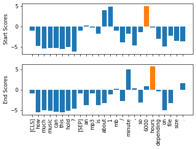
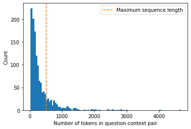
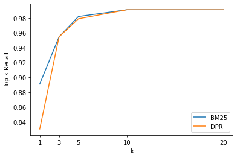
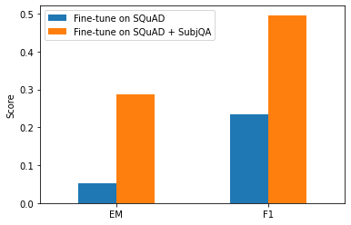
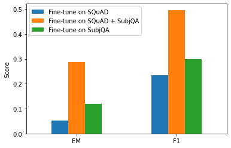

* [Introduction](#introduction)
* [Project: Build a Review-Based QA System](#project-build-a-review-based-qa-system)
* [Improving Our QA Pipeline](#improving-our-qa-pipeline)
* [Going Beyond Extractive QA](#going-beyond-extractive-qa)
* [Conclusion](#conclusion)
* [References](#references)


------

```python
import transformers
import datasets

# Only print error messages
transformers.logging.set_verbosity_error()
datasets.logging.set_verbosity_error()

transformers.__version__, datasets.__version__
```
```text
    ('4.6.1', '1.11.0')
```

------

```python
import pandas as pd
pd.set_option('max_colwidth', None)
pd.set_option('display.max_rows', None)
pd.set_option('display.max_columns', None)
```


```python
import ast
# https://astor.readthedocs.io/en/latest/
import astor
import inspect
import textwrap
def print_source(obj, exclude_doc=True):
    
    # Get source code
    source = inspect.getsource(obj)
    # Remove any common leading whitespace from every line
    cleaned_source = textwrap.dedent(source)
    # Parse the source into an AST node.
    parsed = ast.parse(cleaned_source)

    for node in ast.walk(parsed):
        # Skip any nodes that are not class or function definitions
        if not isinstance(node, (ast.FunctionDef, ast.ClassDef, ast.AsyncFunctionDef)):
            continue
        
        if exclude_doc and len(node.body) > 1: node.body = node.body[1:]
        
    print(astor.to_source(parsed))
```

------


**Disable Tokenizers Parallelism**


```python
%env TOKENIZERS_PARALLELISM=false
```
```text
    env: TOKENIZERS_PARALLELISM=false
```

------

**Suppress Haystack logging**


```python
import logging
for module in ["farm.utils", "farm.infer", "haystack.reader.farm.FARMReader",
              "farm.modeling.prediction_head", "elasticsearch", "haystack.eval",
               "haystack.document_store.base", "haystack.retriever.base", 
              "farm.data_handler.dataset"]:
    module_logger = logging.getLogger(module)
    module_logger.setLevel(logging.ERROR)
```

------


## Introduction

* Extractive question answering is the most common form and requires the answer to be available as a span of text in a document.
* Community question answering involves gathering question-answer pairs generated by users. We then use semantic similarity search to find the closest matching answer to a new question.
* Long-form question answering aims to generate complex paragraph-length answers to open-ended questions.
* It is also possible to perform question answering over tables.
    * Transformer models like [TAPAS](https://huggingface.co/google/tapas-base-finetuned-wtq) can perform aggregations to produce the final answer.
    
* The domain of data a QA system has access to usually determines how it is categorized.
    * Closed-domain QA deals with questions about a narrow topic like a single product category.
    * Open-domain QA deals with questions about almost anything.


## Project: Build a Review-Based QA System

* The goal is to build a question-answering model that finds answers to questions in customer reviews.

### The Dataset
* [SubjQA: A Dataset for Subjectivity and Review Comprehension](https://arxiv.org/abs/2004.14283)
* [GitHub Repository](https://github.com/megagonlabs/SubjQA)
* [Hugging Face Dataset Card](https://huggingface.co/datasets/subjqa)
* SubjQA is a question answering dataset that focuses on subjective (as opposed to factual) questions and answers.
* The dataset contains approximately 10,000 questions over reviews from six domains, including books, movies, grocery, electronics, TripAdvisor, and restaurants.
* Each question is associated with a review that contains the answer.
* The dataset includes unanswerable questions designed to produce more robust models.
* The subjectivity of the questions and answers makes the task potentially more challenging than if they were factual.

------


```python
from datasets import get_dataset_config_names
```

------

**Get the names of the domains in the SubjQA dataset**


```python
domains = get_dataset_config_names("subjqa")
domains
```
```text
    ['books', 'electronics', 'grocery', 'movies', 'restaurants', 'tripadvisor']
```

------

```python
from datasets import load_dataset
```

------

**Load the electronics subset of the SubjQA dataset**


```python
subjqa = load_dataset("subjqa", name="electronics")
```


```python
subjqa
```
```text
    DatasetDict({
        train: Dataset({
            features: ['domain', 'nn_mod', 'nn_asp', 'query_mod', 'query_asp', 'q_reviews_id', 'question_subj_level', 'ques_subj_score', 'is_ques_subjective', 'review_id', 'id', 'title', 'context', 'question', 'answers'],
            num_rows: 1295
        })
        test: Dataset({
            features: ['domain', 'nn_mod', 'nn_asp', 'query_mod', 'query_asp', 'q_reviews_id', 'question_subj_level', 'ques_subj_score', 'is_ques_subjective', 'review_id', 'id', 'title', 'context', 'question', 'answers'],
            num_rows: 358
        })
        validation: Dataset({
            features: ['domain', 'nn_mod', 'nn_asp', 'query_mod', 'query_asp', 'q_reviews_id', 'question_subj_level', 'ques_subj_score', 'is_ques_subjective', 'review_id', 'id', 'title', 'context', 'question', 'answers'],
            num_rows: 255
        })
    })
```


**Note:** SubjQA stores the answers to each question as a nested dictionary.

------

**Inspect an answer from the dataset**


```python
pd.DataFrame(subjqa["train"]["answers"][1])
```
<div style="overflow-x:auto;">
<table border="1" class="dataframe">
  <thead>
    <tr style="text-align: right;">
      <th></th>
      <th>text</th>
      <th>answer_start</th>
      <th>answer_subj_level</th>
      <th>ans_subj_score</th>
      <th>is_ans_subjective</th>
    </tr>
  </thead>
  <tbody>
    <tr>
      <th>0</th>
      <td>Bass is weak as expected</td>
      <td>1302</td>
      <td>1</td>
      <td>0.508333</td>
      <td>True</td>
    </tr>
    <tr>
      <th>1</th>
      <td>Bass is weak as expected, even with EQ adjusted up</td>
      <td>1302</td>
      <td>1</td>
      <td>0.508333</td>
      <td>True</td>
    </tr>
  </tbody>
</table>
</div>
------


**Convert each split to a Pandas DataFrame**


```python
dfs = {split: dset.to_pandas() for split, dset in subjqa.flatten().items()}

for split, df in dfs.items():
    print(f"Number of questions in {split}: {df['id'].nunique()}")
```
```text
    Number of questions in train: 1295
    Number of questions in test: 358
    Number of questions in validation: 255
```

**Note:**
* The dataset is relatively small, with 1,908 total examples.
* Real-world QA datasets are likely to be small as it is expensive and labor-intensive to have domain experts label extractive QA datasets.
* The [CUAD](https://arxiv.org/abs/2103.06268) dataset for extractive QA on legal contracts has an estimated value of two million dollars to account for the legal expertise needed to annotate its 13,000 examples.

------

#### Columns of Interest

| Column Name          | Description                                                  |
| -------------------- | ------------------------------------------------------------ |
| title                | The Amazon Standard Identification Number (ASIN) associated with each product |
| question             | The question                                                 |
| answers.answer_text  | The span of text in the reivew labeled by the annotator      |
| answers.answer_start | The start character index of the answer span                 |
| context              | The customer review                                          |

------

**Inspect some random training examples**


```python
qa_cols = ["title", "question", "answers.text", "answers.answer_start", "context"]
sample_df = dfs["train"][qa_cols].sample(2, random_state=7)
sample_df
```
<div style="overflow-x:auto;">
<table border="1" class="dataframe">
  <thead>
    <tr style="text-align: right;">
      <th></th>
      <th>title</th>
      <th>question</th>
      <th>answers.text</th>
      <th>answers.answer_start</th>
      <th>context</th>
    </tr>
  </thead>
  <tbody>
    <tr>
      <th>791</th>
      <td>B005DKZTMG</td>
      <td>Does the keyboard lightweight?</td>
      <td>[this keyboard is compact]</td>
      <td>[215]</td>
      <td>I really like this keyboard.  I give it 4 stars because it doesn't have a CAPS LOCK key so I never know if my caps are on.  But for the price, it really suffices as a wireless keyboard.  I have very large hands and this keyboard is compact, but I have no complaints.</td>
    </tr>
    <tr>
      <th>1159</th>
      <td>B00AAIPT76</td>
      <td>How is the battery?</td>
      <td>[]</td>
      <td>[]</td>
      <td>I bought this after the first spare gopro battery I bought wouldn't hold a charge. I have very realistic expectations of this sort of product, I am skeptical of amazing stories of charge time and battery life but I do expect the batteries to hold a charge for a couple of weeks at least and for the charger to work like a charger. In this I was not disappointed. I am a river rafter and found that the gopro burns through power in a hurry so this purchase solved that issue. the batteries held a charge, on shorter trips the extra two batteries were enough and on longer trips I could use my friends JOOS Orange to recharge them.I just bought a newtrent xtreme powerpak and expect to be able to charge these with that so I will not run out of power again.</td>
    </tr>
  </tbody>
</table>
</div>
**Note:**

* The questions are not grammatically correct.
* An empty text entry denotes an "unanswerable" question whose answer is not present in the review.
* We can use the start index and length of the answer span to slice out the span of text in the review that corresponds to the answer.

------

**Slice out a span of text that corresponds to the answer**


```python
start_idx = sample_df["answers.answer_start"].iloc[0][0]
end_idx = start_idx + len(sample_df["answers.text"].iloc[0][0])
sample_df["context"].iloc[0][start_idx:end_idx]
```
```text
    'this keyboard is compact'
```

------

```python
import matplotlib.pyplot as plt
```

------

**Count the questions that begin with common starting words**


```python
counts = {}
question_types = ["What", "How", "Is", "Does", "Do", "Was", "Where", "Why"]

for q in question_types:
    counts[q] = dfs["train"]["question"].str.startswith(q).value_counts()[True]

pd.Series(counts).sort_values().plot.barh()
plt.title("Frequency of Question Types")
plt.show()
```


**Note:** Questions that begin with "How," "What," and "Is" are the most common.

------

**Look at examples with the most common starting words**


```python
for question_type in ["How", "What", "Is"]:
    for question in (
        dfs["train"][dfs["train"].question.str.startswith(question_type)]
        .sample(n=3, random_state=42)['question']):
        print(question)
```
```text
    How is the camera?
    How do you like the control?
    How fast is the charger?
    What is direction?
    What is the quality of the construction of the bag?
    What is your impression of the product?
    Is this how zoom works?
    Is sound clear?
    Is it a wireless keyboard?
```

------


### The Stanford Question Answering Dataset (SQuAD)

* [SQuAD: 100,000+ Questions for Machine Comprehension of Text](https://arxiv.org/abs/1606.05250)
* [Know What You Don't Know: Unanswerable Questions for SQuAD](https://arxiv.org/abs/1806.03822)
* The Standford Question Answering Dataset is a famous dataset for testing the ability of machines to read a passage of text and answer questions about it.
* The dataset pioneered the (question, review, [answer sentences]) format used in SubjQA.
* The creators sampled several hundred English articles from Wikipedia and asked crowd workers to generate a set of questions and answers for each paragraph.
* Most models since 2019 surpass human performance on this dataset.
    * This superhuman performance does not reflect genuine reading comprehension since models can identify answers to the "unanswerable" questions through patterns in the passages like antonyms.
* Google released the [Natural Questions (NQ) dataset](https://direct.mit.edu/tacl/article/doi/10.1162/tacl_a_00267/43495/What-You-Say-and-How-You-Say-it-Joint-Modeling-of), which involves fact-seeking questions obtained from Google Search users.
    * The answers in NQ are much longer than in SQuAD and present a more challenging benchmark.

### Extracting Answers from Text
* We need a way to identify a potential answer as a span of text in a customer review.
    * Frame the supervised learning problems.
    * Tokenize and encode text for QA tasks.
    * Deal with long passages that exceed a model's maximum context size.

#### Span classification
* The model needs to predict the start and end tokens of an answer.
* This approach is the most common way to extract answers from a text.

#### Transfer Learning
* We can compensate for a relatively small dataset by starting with a language model fine-tuned on a large-scale QA dataset like SQuAD.
* These models typically have strong reading comprehension capabilities and serve as a good baseline.
* [Hugging Face Hub models trained on SQuAD](https://huggingface.co/models?dataset=dataset:squad&sort=downloads)

**Baseline transformer models fine-tuned on SQuAD 2.0**

| Transformer       | Description                                                  | Numbers of parameters | $F_{1}$-score on SQUAD 2.0 |
| ----------------- | ------------------------------------------------------------ | --------------------- | -------------------------- |
| [MiniLM](https://huggingface.co/deepset/minilm-uncased-squad2)            | A distilled version of BERT-base that preserves 99% of the performance while being twice as fast. | 66M                   | 79.5                       |
| [RoBERTa-base](https://huggingface.co/roberta-base)      | RoBERTa models have better performance than their BERT counterparts and can fine-tune on most QA datasets using a single GPU. | 125M                  | 83.0                       |
| [ALBERT-XXL](https://huggingface.co/models?pipeline_tag=question-answering&sort=downloads&search=albert-xxl)        | State-of-the-art performance on SQuAD 2.0, but computationally intensive and difficult to deploy. | 235M                  | 88.1                       |
| [XLM-RoBERTa-large](https://huggingface.co/models?search=xlm-roberta-large) | Multilingual model for 100 languages with strong zero-shot performance. | 570M                  | 83.8                       |


#### Tokenizing text for QA

------


```python
from transformers import AutoTokenizer
```

------

**Instantiate a tokenizer for the MiniLM model**

* [MiniLM Hugging Face Model Card](https://huggingface.co/deepset/minilm-uncased-squad2)
* [MiniLM: Deep Self-Attention Distillation for Task-Agnostic Compression of Pre-Trained Transformers](https://arxiv.org/abs/2002.10957)

------


```python
model_ckpt = "deepset/minilm-uncased-squad2"
tokenizer = AutoTokenizer.from_pretrained(model_ckpt)
```
------

**Tokenize a question-context pair**


```python
question = "How much music can this hold?"
context = """An MP3 is about 1 MB/minute, so about 6000 hours depending on \
file size."""
inputs = tokenizer(question, context, return_tensors="pt")
```

------

**Inspect tokenized inputs**


```python
input_df = pd.DataFrame.from_dict(tokenizer(question, context), orient="index")
input_df
```
<div style="overflow-x:auto;">
<table border="1" class="dataframe">
  <thead>
    <tr style="text-align: right;">
      <th></th>
      <th>0</th>
      <th>1</th>
      <th>2</th>
      <th>3</th>
      <th>4</th>
      <th>5</th>
      <th>6</th>
      <th>7</th>
      <th>8</th>
      <th>9</th>
      <th>10</th>
      <th>11</th>
      <th>12</th>
      <th>13</th>
      <th>14</th>
      <th>15</th>
      <th>16</th>
      <th>17</th>
      <th>18</th>
      <th>19</th>
      <th>20</th>
      <th>21</th>
      <th>22</th>
      <th>23</th>
      <th>24</th>
      <th>25</th>
      <th>26</th>
      <th>27</th>
    </tr>
  </thead>
  <tbody>
    <tr>
      <th>input_ids</th>
      <td>101</td>
      <td>2129</td>
      <td>2172</td>
      <td>2189</td>
      <td>2064</td>
      <td>2023</td>
      <td>2907</td>
      <td>1029</td>
      <td>102</td>
      <td>2019</td>
      <td>23378</td>
      <td>2003</td>
      <td>2055</td>
      <td>1015</td>
      <td>16914</td>
      <td>1013</td>
      <td>3371</td>
      <td>1010</td>
      <td>2061</td>
      <td>2055</td>
      <td>25961</td>
      <td>2847</td>
      <td>5834</td>
      <td>2006</td>
      <td>5371</td>
      <td>2946</td>
      <td>1012</td>
      <td>102</td>
    </tr>
    <tr>
      <th>token_type_ids</th>
      <td>0</td>
      <td>0</td>
      <td>0</td>
      <td>0</td>
      <td>0</td>
      <td>0</td>
      <td>0</td>
      <td>0</td>
      <td>0</td>
      <td>1</td>
      <td>1</td>
      <td>1</td>
      <td>1</td>
      <td>1</td>
      <td>1</td>
      <td>1</td>
      <td>1</td>
      <td>1</td>
      <td>1</td>
      <td>1</td>
      <td>1</td>
      <td>1</td>
      <td>1</td>
      <td>1</td>
      <td>1</td>
      <td>1</td>
      <td>1</td>
      <td>1</td>
    </tr>
    <tr>
      <th>attention_mask</th>
      <td>1</td>
      <td>1</td>
      <td>1</td>
      <td>1</td>
      <td>1</td>
      <td>1</td>
      <td>1</td>
      <td>1</td>
      <td>1</td>
      <td>1</td>
      <td>1</td>
      <td>1</td>
      <td>1</td>
      <td>1</td>
      <td>1</td>
      <td>1</td>
      <td>1</td>
      <td>1</td>
      <td>1</td>
      <td>1</td>
      <td>1</td>
      <td>1</td>
      <td>1</td>
      <td>1</td>
      <td>1</td>
      <td>1</td>
      <td>1</td>
      <td>1</td>
    </tr>
  </tbody>
</table>
</div>
**Note:**

* The token_type_ids tensor indicates which part of the inputs corresponds to the question and context.
    * A 0 indicates a question token.
    * A 1 indicates a context token.
* The token_type_ids are not present in all transformer models.
* BERT-like models use token_type_ids during pretraining to incorporate the next sentence prediction task. 

------

**Decode the input_ids tensor**


```python
print(tokenizer.decode(inputs["input_ids"][0]))
```
```text
    [CLS] how much music can this hold? [SEP] an mp3 is about 1 mb / minute, so about 6000 hours depending on file size. [SEP]
```

**Note:** The token_type_ids tensor determines the location of the first `[SEP]` token.

------


```python
import torch
from transformers import AutoModelForQuestionAnswering
```

------


#### `AutoModelForQuestionAnswering`

* [Documentation](https://huggingface.co/docs/transformers/main/en/model_doc/auto#transformers.AutoModelForQuestionAnswering)

------

**Instantiate the MiniLM model with a QA head**


```python
model = AutoModelForQuestionAnswering.from_pretrained(model_ckpt)
```


```python
type(model)
```
```text
    transformers.models.bert.modeling_bert.BertForQuestionAnswering
```

------

#### `BertForQuestionAnswering`

* [Documentation](https://huggingface.co/docs/transformers/main/en/model_doc/bert#transformers.BertForQuestionAnswering)
* Create a BERT Model with a span classification head on top for extractive question-answering tasks.

------


```python
[child[0] for child in list(model.named_children())]
```
```text
    ['bert', 'qa_outputs']
```

------

```python
list(model.named_children())[1]
```
```text
    ('qa_outputs', Linear(in_features=384, out_features=2, bias=True))
```

------

**Note:**

* We treat QA as a form of token classification.
* The QA head takes the hidden states from the encoder and computes the logits for the start and end spans.

------

**Run inputs through the forward pass**


```python
with torch.no_grad():
    outputs = model(**inputs)
print(outputs)
```
```text
    QuestionAnsweringModelOutput(loss=None, start_logits=tensor([[-0.9862, -4.7750, -5.4025, -5.2378, -5.2863, -5.5117, -4.9819, -6.1880,
             -0.9862,  0.2596, -0.2144, -1.7136,  3.7806,  4.8561, -1.0546, -3.9097,
             -1.7374, -4.5944, -1.4278,  3.9949,  5.0391, -0.2018, -3.0193, -4.8549,
             -2.3107, -3.5110, -3.5713, -0.9862]]), end_logits=tensor([[-0.9623, -5.4733, -5.0326, -5.1639, -5.4278, -5.5151, -5.1749, -4.6233,
             -0.9623, -3.7855, -0.8715, -3.7745, -3.0161, -1.1780,  0.1758, -2.7365,
              4.8934,  0.3047, -3.1761, -3.2762,  0.8937,  5.6606, -0.3623, -4.9554,
             -3.2531, -0.0914,  1.6211, -0.9623]]), hidden_states=None, attentions=None)
```

------


```python
type(outputs)
```
```text
    transformers.modeling_outputs.QuestionAnsweringModelOutput
```

------


#### `QuestionAnsweringModelOutput`

* [Documentation](https://huggingface.co/docs/transformers/main/en/main_classes/output#transformers.modeling_outputs.QuestionAnsweringModelOutput)

------


```python
print_source(transformers.modeling_outputs.QuestionAnsweringModelOutput)
```
```text
    @dataclass
    class QuestionAnsweringModelOutput(ModelOutput):
        loss: Optional[torch.FloatTensor] = None
        start_logits: torch.FloatTensor = None
        end_logits: torch.FloatTensor = None
        hidden_states: Optional[Tuple[torch.FloatTensor]] = None
        attentions: Optional[Tuple[torch.FloatTensor]] = None
```

------

**Get the logits for the start and end tokens**


```python
start_logits = outputs.start_logits
end_logits = outputs.end_logits
```

------


```python
torch.argmax(start_logits), start_logits
```
```text
    (tensor(20),
     tensor([[-0.9862, -4.7750, -5.4025, -5.2378, -5.2863, -5.5117, -4.9819, -6.1880,
              -0.9862,  0.2596, -0.2144, -1.7136,  3.7806,  4.8561, -1.0546, -3.9097,
              -1.7374, -4.5944, -1.4278,  3.9949,  5.0391, -0.2018, -3.0193, -4.8549,
              -2.3107, -3.5110, -3.5713, -0.9862]]))
```

------

```python
torch.argmax(end_logits), end_logits
```
```text
    (tensor(21),
     tensor([[-0.9623, -5.4733, -5.0326, -5.1639, -5.4278, -5.5151, -5.1749, -4.6233,
              -0.9623, -3.7855, -0.8715, -3.7745, -3.0161, -1.1780,  0.1758, -2.7365,
               4.8934,  0.3047, -3.1761, -3.2762,  0.8937,  5.6606, -0.3623, -4.9554,
              -3.2531, -0.0914,  1.6211, -0.9623]]))
```

**Note:** The larger, positive values correspond to more likely candidates for the start and end tokens.

------

**Compare the logit shapes to the input IDs**


```python
print(f"Input IDs shape: {inputs.input_ids.size()}")
print(f"Start logits shape: {start_logits.size()}")
print(f"End logits shape: {end_logits.size()}")
```
```text
    Input IDs shape: torch.Size([1, 28])
    Start logits shape: torch.Size([1, 28])
    End logits shape: torch.Size([1, 28])
```

**Note:** There is a start and end logit associated with each input token.

------


```python
tokenizer.decode(inputs.input_ids[0][torch.argmax(start_logits):torch.argmax(end_logits)+1])
```
```text
    '6000 hours'
```

------

```python
import numpy as np
import matplotlib.pyplot as plt
```

------

**Visualize the predicted logits for the start and end tokens**

* [Question Answering with a Fine-Tuned BERT](https://mccormickml.com/2020/03/10/question-answering-with-a-fine-tuned-BERT/)

------


```python
s_scores = start_logits.detach().numpy().flatten()
e_scores = end_logits.detach().numpy().flatten()
tokens = tokenizer.convert_ids_to_tokens(inputs["input_ids"][0])

fig, (ax1, ax2) = plt.subplots(nrows=2, sharex=True)
colors = ["C0" if s != np.max(s_scores) else "C1" for s in s_scores]
ax1.bar(x=tokens, height=s_scores, color=colors)
ax1.set_ylabel("Start Scores")
colors = ["C0" if s != np.max(e_scores) else "C1" for s in e_scores]
ax2.bar(x=tokens, height=e_scores, color=colors)
ax2.set_ylabel("End Scores")
plt.xticks(rotation="vertical")
plt.show()
```


------

**Extract the answer using the most likely start and end candidates**


```python
start_idx = torch.argmax(start_logits)  
end_idx = torch.argmax(end_logits) + 1  
answer_span = inputs["input_ids"][0][start_idx:end_idx]
answer = tokenizer.decode(answer_span)
print(f"Question: {question}")
print(f"Answer: {answer}")
```
```text
    Question: How much music can this hold?
    Answer: 6000 hours
```

**Note:**
* Using the indices with the max values of the start and end logits can produce out-of-scope answers by selecting tokens that belong to the question instead of the context.
* A question answering pipeline computes the best combination of start and end indices using various constraints such as being in-scope, requiring the start indices to precede the end indices.

------


```python
from transformers import pipeline
```

------

**Instantiate a question answering pipeline with the MiniML model**


```python
pipe = pipeline("question-answering", model=model, tokenizer=tokenizer)
type(pipe)
```
```text
    transformers.pipelines.question_answering.QuestionAnsweringPipeline
```

------


#### `QuestionAnsweringPipeline`

* [Documentation](https://huggingface.co/docs/transformers/main/en/main_classes/pipelines#transformers.QuestionAnsweringPipeline)
* Create a question anwering pipeline

------

**Get the top 3 most likely answers to the question**


```python
pipe(question=question, context=context, topk=3)
```
```text
    [{'score': 0.2651616930961609, 'start': 38, 'end': 48, 'answer': '6000 hours'},
     {'score': 0.2208297997713089,
      'start': 16,
      'end': 48,
      'answer': '1 MB/minute, so about 6000 hours'},
     {'score': 0.10253523290157318,
      'start': 16,
      'end': 27,
      'answer': '1 MB/minute'}]
```


**Note:**
* The score field contains the model's probability estimate for each answer.
* The model assigns a high start and end score to the `[CLS]` token when there is no answer to a question, and the pipeline maps this output to an empty string.

------

**Ask an unanswerable question**


```python
pipe(question="Why is there no data?", context=context, handle_impossible_answer=True)
```
```text
    {'score': 0.9068416357040405, 'start': 0, 'end': 0, 'answer': ''}
```

------


#### Dealing with long passages

* The context often contains more tokens than the maximum sequence length of the model.
* A decent portion of the SubjQA training set contains question-context pairs that won't fit within MiniLM's context size of 512 tokens.
* Truncating long texts is problematic for QA tasks as the answer could be near the end of the context.
* The standard way to deal with long texts for QA is to apply a sliding window across the inputs, where each window contains a passage of tokens that fit in the model's context.

**Distribution of tokens for each question-context pair in the SubjQA training set**


```python
def compute_input_length(row):
    inputs = tokenizer(row["question"], row["context"])
    return len(inputs["input_ids"])

dfs["train"]["n_tokens"] = dfs["train"].apply(compute_input_length, axis=1)

fig, ax = plt.subplots()
dfs["train"]["n_tokens"].hist(bins=100, grid=False, ec="C0", ax=ax)
plt.xlabel("Number of tokens in question-context pair")
ax.axvline(x=512, ymin=0, ymax=1, linestyle="--", color="C1", 
           label="Maximum sequence length")
plt.legend()
plt.ylabel("Count")
plt.show()
```


------

**Enable the sliding window for the tokenizer**


```python
example = dfs["train"].iloc[0][["question", "context"]]
tokenized_example = tokenizer(example["question"], example["context"], 
                              return_overflowing_tokens=True, max_length=100, 
                              stride=25)
```

**Note:** We now get a list containing input_ids for each window.

------

**Get the number of tokens in each window**


```python
for idx, window in enumerate(tokenized_example["input_ids"]):
    print(f"Window #{idx} has {len(window)} tokens")
```
```text
    Window #0 has 100 tokens
    Window #1 has 88 tokens
```

------

**View where the windows overlap**


```python
for window in tokenized_example["input_ids"]:
    print(f"{tokenizer.decode(window)} \n")
```
```text
    [CLS] how is the bass? [SEP] i have had koss headphones in the past, pro 4aa and
    qz - 99. the koss portapro is portable and has great bass response. the work
    great with my android phone and can be " rolled up " to be carried in my
    motorcycle jacket or computer bag without getting crunched. they are very light
    and don't feel heavy or bear down on your ears even after listening to music
    with them on all day. the sound is [SEP]
    
    [CLS] how is the bass? [SEP] and don't feel heavy or bear down on your ears even
    after listening to music with them on all day. the sound is night and day better
    than any ear - bud could be and are almost as good as the pro 4aa. they are "
    open air " headphones so you cannot match the bass to the sealed types, but it
    comes close. for $ 32, you cannot go wrong. [SEP]
```

------


### Using Haystack to Build a QA Pipeline

* Real-world users will only provide a question about a product rather than a question-context pair.
* We need a way of selecting relevant passages from among all the reviews in our corpus.
* We could concatenate all the reviews of a given product and feed them to the model as a single context.
* This approach can introduce unacceptable latency for our user's queries when the context gets too long.
* Modern QA systems typically use the retriever-reader architecture.

#### Retriever-Reader Architecture
* The retriever is responsible for retrieving relevant documents for a given query.
* Retrievers can be either sparse or dense.
    * Sparse retrievers use word frequencies to represent each document and query as a vector where most elements are zero.
        * The retriever computes the inner dot product of a query vector and a document vector to determine their relevance.
    * Dense retrievers use encoders to represent the query and document as contextualized embeddings.
        * These embeddings encode semantic meaning and allow dense retrievers to improve search accuracy by understanding the content of the query.
* The reader is responsible for extracting an answer from the documents provided by the retriever.
* The reader is usually a reading comprehension model.
* There can also be other components that apply postprocessing to the documents fetched by the retriever or to the answers extracted by the reader.
* The retrieved documents may need reranking to eliminate noisy or irrelevant ones that might confuse the reader.
* The reader's answers might require postprocessing when the correct answer comes from various passages in a lengthy document.

#### Haystack
* [Homepage](https://haystack.deepset.ai/overview/intro)
* Haystack is an open-source framework for building search systems that work over massive document collectors.
* Haystack integrates tightly with Hugging Face Transformers.
* Haystack builds on the retriever-reader architecture by adding a document store and a pipeline component.
* The document store component is a document-oriented database that stores the documents and metadata provided to the retriever at query time.
* The pipeline combines all the components of a QA system to enable custom query flows, merging documents from multiple retrievers, etc.


#### Initializing a document store
* Haystack provides various document stores to choose from, and we can pair each one with a dedicated set of retrievers.

**Compatibility of Haystack retreivers and document stores**

|           | In memory | Elasticsearch | FAISS | Milvus |
| --------- | --------- | ------------- | ----- | ------ |
| [TF-IDF](https://haystack.deepset.ai/docs/v0.4.0/retrievermd#tf-idf)    | Yes       | Yes           | No    | No     |
| [BM25](https://haystack.deepset.ai/docs/v0.4.0/retrievermd#bm25-recommended)      | No        | Yes           | No    | No     |
| [Embedding](https://haystack.deepset.ai/docs/v0.4.0/retrievermd#embedding-retrieval) | Yes       | Yes           | Yes   | Yes    |
| [DPR](https://haystack.deepset.ai/docs/v0.4.0/retrievermd#dense-passage-retrieval-recommended)       | Yes       | Yes           | Yes   | Yes    |

------


#### Elasticsearch

* [Installation Guide](https://www.elastic.co/guide/en/elasticsearch/reference/current/targz.html)
* Elasticsearch is a search engine that can handle textual, numerical, geospatial, structured, and unstructured data.
* Elasticsearch can store huge volumes of data and quickly filter it with full-text search features.
* It is the industry standard for infrastructure analytics.

**Download and unpack Elasticsearch**


```python
url = """https://artifacts.elastic.co/downloads/elasticsearch/\
elasticsearch-7.9.2-linux-x86_64.tar.gz"""
!wget -nc -q {url}
!tar -xzf elasticsearch-7.9.2-linux-x86_64.tar.gz
```

------


```python
import os
from subprocess import Popen, PIPE, STDOUT
```

------

#### `Popen`

* [Documentation](https://docs.python.org/3/library/subprocess.html#subprocess.Popen)
* Execute a child program in a new process.

#### `Pipe`
* [Documentation](https://docs.python.org/3/library/subprocess.html#subprocess.PIPE)

#### `STDOUT`
* [Documentation](https://docs.python.org/3/library/subprocess.html#subprocess.STDOUT)

**Start the Elasticsearch server**


```python
es_dir = "elasticsearch-7.9.2"
```


```python
!echo `pwd`/$es_dir
```
------

```text
    /media/innom-dt/Samsung_T3/Projects/Current_Projects/nlp-with-transformers-book/notebooks/elasticsearch-7.9.2
```


```python
# Run Elasticsearch as a background process
!pkexec chown -R daemon:daemon `pwd`/$es_dir

es_server = Popen(args=['elasticsearch-7.9.2/bin/elasticsearch'],
                  stdout=PIPE, stderr=STDOUT)
# Wait until Elasticsearch has started
!sleep 30
```

------

```python
!lsof -i :9200
```
```text
    COMMAND   PID     USER   FD   TYPE DEVICE SIZE/OFF NODE NAME
    python   5323 innom-dt   67u  IPv4 146772      0t0  TCP localhost:41918->localhost:9200 (ESTABLISHED)
    java    11790 innom-dt  243u  IPv6 147757      0t0  TCP localhost:9200->localhost:41918 (ESTABLISHED)
    java    11790 innom-dt  295u  IPv6 126562      0t0  TCP ip6-localhost:9200 (LISTEN)
    java    11790 innom-dt  296u  IPv6 126563      0t0  TCP localhost:9200 (LISTEN)
```

------


```python
# Alternative if Docker is installed
# from haystack.utils import launch_es

# launch_es()
```

------

**Test the connection to the local Elasticsearch**


```python
!curl -X GET "localhost:9200/?pretty"
```
```text
    {
      "name" : "innomdt",
      "cluster_name" : "elasticsearch",
      "cluster_uuid" : "qci_PXdYR4uva2XnE7o-4Q",
      "version" : {
        "number" : "7.9.2",
        "build_flavor" : "default",
        "build_type" : "tar",
        "build_hash" : "d34da0ea4a966c4e49417f2da2f244e3e97b4e6e",
        "build_date" : "2020-09-23T00:45:33.626720Z",
        "build_snapshot" : false,
        "lucene_version" : "8.6.2",
        "minimum_wire_compatibility_version" : "6.8.0",
        "minimum_index_compatibility_version" : "6.0.0-beta1"
      },
      "tagline" : "You Know, for Search"
    }
```

------


```python
from haystack.document_store.elasticsearch import ElasticsearchDocumentStore
```

------


#### `ElasticsearchDocumentStore`

* [Documentation](https://haystack.deepset.ai/reference/document-store#elasticsearchdocumentstore)
* Create a DocumentStore using Elasticsearch to store and query the documents for our search.

**Instantiate the document store**


```python
# Return the document embedding for later use with dense retriever 
document_store = ElasticsearchDocumentStore(return_embedding=True)
```

**Note:** ElasticsearchDocumentStore creates an index called document for storing documents and an index called label for storing the annotated answer spans.

------

**Flush Elasticsearch with each notebook restart**


```python
if len(document_store.get_all_documents()) or len(document_store.get_all_labels()) > 0:
    document_store.delete_documents("document")
    document_store.delete_documents("label")
```

------

**Populate the document index with the SubjQA reviews**


```python
for split, df in dfs.items():
    # Exclude duplicate reviews
    docs = [{"text": row["context"], 
             "meta":{"item_id": row["title"], "question_id": row["id"], 
                     "split": split}} 
        for _,row in df.drop_duplicates(subset="context").iterrows()]
    document_store.write_documents(docs, index="document")
    
print(f"Loaded {document_store.get_document_count()} documents")
```
```text
    Loaded 1615 documents
```

------


#### Initializing a retriever


```python
from haystack.retriever.sparse import ElasticsearchRetriever
```

------

#### `ElasticsearchRetriever`

* [Documentation](https://haystack.deepset.ai/reference/retriever#elasticsearchretriever)
* The ElasticsearchRetriever uses the BM25 retriever by default.

**Initialize a sparse retriever based on BM25**
* BM25 is an improved version of the Term Frequency-Inverse Document Frequency (TF-IDF) algorithm and represents the question and context as sparse vectors.
* BM25 improves on TF-IDF by saturating TF (how many times words in the query occur in a document) values after a set number of occurrences of the given term. It also normalizes the document length to favor short documents over long ones.
* [TF-IDF and BM25 Explanation](https://web.stanford.edu/~jurafsky/slp3/23.pdf)

------


```python
es_retriever = ElasticsearchRetriever(document_store=document_store)
```

------

**Examine a simple query for a single electronics product**

* For review-based QA systems, it is crucial to restrict the queries to a single item.
    * Otherwise, the retriever would source reviews about products unrelated to the user's query.
* We can decipher ASIN values with online tools like amazon ASIN or by appending the value of item_id to the [www.amazon.com/dp/](www.amazon.com/dp/) URL.

------


```python
item_id = "B0074BW614"
query = "Is it good for reading?"
retrieved_docs = es_retriever.retrieve(
    query=query, top_k=3, filters={"item_id":[item_id], "split":["train"]})
```

**Note:**

* The top_k argument specifies how many documents to return.
* The specified filters ensure we only receive documents from the training set about the desired product.
* Each element of retrieved_docs is a Haystack Document object used to represent documents and includes the retriever's query score and other metadata.

------

**Examine one of the retrieved documents**


```python
print(retrieved_docs[0])
```
```text
    {'text': 'This is a gift to myself.  I have been a kindle user for 4 years and this is my third one.  I never thought I would want a fire for I mainly use it for book reading.  I decided to try the fire for when I travel I take my laptop, my phone and my iPod classic.  I love my iPod but watching movies on the plane with it can be challenging because it is so small. Laptops battery life is not as good as the Kindle.  So the Fire combines for me what I needed all three to do. So far so good.', 'score': 6.243799, 'probability': 0.6857824513476455, 'question': None, 'meta': {'item_id': 'B0074BW614', 'question_id': '868e311275e26dbafe5af70774a300f3', 'split': 'train'}, 'embedding': None, 'id': '252e83e25d52df7311d597dc89eef9f6'}
```

------


```python
sample_doc = retrieved_docs[0].to_dict()
sample_doc.update(sample_doc['meta'])
del sample_doc['meta']
pd.DataFrame(sample_doc.items()).T
```
<div style="overflow-x:auto;">
<table border="1" class="dataframe">
  <thead>
    <tr style="text-align: right;">
      <th></th>
      <th>0</th>
      <th>1</th>
      <th>2</th>
      <th>3</th>
      <th>4</th>
      <th>5</th>
      <th>6</th>
      <th>7</th>
      <th>8</th>
    </tr>
  </thead>
  <tbody>
    <tr>
      <th>0</th>
      <td>text</td>
      <td>score</td>
      <td>probability</td>
      <td>question</td>
      <td>embedding</td>
      <td>id</td>
      <td>item_id</td>
      <td>question_id</td>
      <td>split</td>
    </tr>
    <tr>
      <th>1</th>
      <td>This is a gift to myself.  I have been a kindle user for 4 years and this is my third one.  I never thought I would want a fire for I mainly use it for book reading.  I decided to try the fire for when I travel I take my laptop, my phone and my iPod classic.  I love my iPod but watching movies on the plane with it can be challenging because it is so small. Laptops battery life is not as good as the Kindle.  So the Fire combines for me what I needed all three to do. So far so good.</td>
      <td>6.243799</td>
      <td>0.685782</td>
      <td>None</td>
      <td>None</td>
      <td>252e83e25d52df7311d597dc89eef9f6</td>
      <td>B0074BW614</td>
      <td>868e311275e26dbafe5af70774a300f3</td>
      <td>train</td>
    </tr>
  </tbody>
</table>
</div>
**Note:**

* A larger scorer implies a document is a better match for the query.
* Elasticsearch relies on [Apache Lucene](https://lucene.apache.org/) for indexing and search.
* Elasticsearch uses [Lucene's practical scoring function](https://www.elastic.co/guide/en/elasticsearch/guide/current/practical-scoring-function.html) by default.
    * The scoring function first filters the candidate documents by applying a Boolean test (does the document match the query?). 
    * The scoring function then applies a similarity metric by representing the document and the query as vectors.

------


#### Initializing a reader
* Haystack provides two types of readers to extract answers from a given context.
* The FARMReader reader builds on Deepset's FARM framework for fine-tuning and deploying transformers.
* FARMreader is compatible with Hugging Face Transformers and can load models directly from the Hugging Face Hub.
* The TransformersReader builds on the QA pipeline from Hugging Face Transformers and is only suitable for running inference.
* Both readers handle a model's weights the same way but convert predictions to answers differently.
* The Hugging Face QA pipeline normalizes the starting and ending logits with a softmax in each passage, so it is only meaningful to compare answers scores from the same section.
* FARM does not normalize logits, meaning we can compare inter-passage answers.
* The TransformersReader sometimes predicts the same answer twice with different scores when the answer lies across two overlapping windows.
* FARM removes the duplicate answers.

------


```python
from haystack.reader.farm import FARMReader
```

------


#### `FARMReader`

* [Documentation](https://haystack.deepset.ai/reference/v0.4.0/reader#farmreader)

**Initialize a FARMReader with the MiniLM model**


```python
model_ckpt = "deepset/minilm-uncased-squad2"
max_seq_length, doc_stride = 384, 128
reader = FARMReader(model_name_or_path=model_ckpt, progress_bar=False,
                    max_seq_len=max_seq_length, doc_stride=doc_stride, 
                    return_no_answer=True)
```
```text
    04/11/2022 17:30:41 - INFO - farm.utils -   Using device: CUDA 
    04/11/2022 17:30:41 - INFO - farm.utils -   Number of GPUs: 1
    04/11/2022 17:30:41 - INFO - farm.utils -   Distributed Training: False
    04/11/2022 17:30:41 - INFO - farm.utils -   Automatic Mixed Precision: None
    Some weights of the model checkpoint at deepset/minilm-uncased-squad2 were not used when initializing BertModel: ['qa_outputs.bias', 'qa_outputs.weight']
    - This IS expected if you are initializing BertModel from the checkpoint of a model trained on another task or with another architecture (e.g. initializing a BertForSequenceClassification model from a BertForPreTraining model).
    - This IS NOT expected if you are initializing BertModel from the checkpoint of a model that you expect to be exactly identical (initializing a BertForSequenceClassification model from a BertForSequenceClassification model).
    04/11/2022 17:30:49 - WARNING - farm.utils -   ML Logging is turned off. No parameters, metrics or artifacts will be logged to MLFlow.
    04/11/2022 17:30:49 - INFO - farm.utils -   Using device: CUDA 
    04/11/2022 17:30:49 - INFO - farm.utils -   Number of GPUs: 1
    04/11/2022 17:30:49 - INFO - farm.utils -   Distributed Training: False
    04/11/2022 17:30:49 - INFO - farm.utils -   Automatic Mixed Precision: None
    04/11/2022 17:30:49 - INFO - farm.infer -   Got ya 15 parallel workers to do inference ...
    04/11/2022 17:30:49 - INFO - farm.infer -    0    0    0    0    0    0    0    0    0    0    0    0    0    0    0 
    04/11/2022 17:30:49 - INFO - farm.infer -   /w\  /w\  /w\  /w\  /w\  /w\  /w\  /|\  /w\  /w\  /w\  /w\  /w\  /w\  /|\
    04/11/2022 17:30:49 - INFO - farm.infer -   /'\  / \  /'\  /'\  / \  / \  /'\  /'\  /'\  /'\  /'\  /'\  / \  /'\  /'\
    04/11/2022 17:30:49 - INFO - farm.infer -                               
```

**Note:**
* We can also fine-tune a reading comprehension model directly with Hugging Face Transformers and load it in TransformersReader to run inference.
* [Tutorial Link](https://colab.research.google.com/github/huggingface/notebooks/blob/main/examples/question_answering.ipynb)

------

**Test the reader**


```python
print(reader.predict_on_texts(question=question, texts=[context], top_k=1))
```
```text
    {'query': 'How much music can this hold?', 'no_ans_gap': 12.648084878921509, 'answers': [{'answer': '6000 hours', 'score': 10.69961929321289, 'probability': 0.3988136053085327, 'context': 'An MP3 is about 1 MB/minute, so about 6000 hours depending on file size.', 'offset_start': 38, 'offset_end': 48, 'offset_start_in_doc': 38, 'offset_end_in_doc': 48, 'document_id': 'e344757014e804eff50faa3ecf1c9c75'}]}
```

------


```python
result = (reader.predict_on_texts(question=question, texts=[context], top_k=1))
result.update(result['answers'][0])
del result['answers']
pd.DataFrame(result.items())
```
<div style="overflow-x:auto;">
<table border="1" class="dataframe">
  <thead>
    <tr style="text-align: right;">
      <th></th>
      <th>0</th>
      <th>1</th>
    </tr>
  </thead>
  <tbody>
    <tr>
      <th>0</th>
      <td>query</td>
      <td>How much music can this hold?</td>
    </tr>
    <tr>
      <th>1</th>
      <td>no_ans_gap</td>
      <td>12.648085</td>
    </tr>
    <tr>
      <th>2</th>
      <td>answer</td>
      <td>6000 hours</td>
    </tr>
    <tr>
      <th>3</th>
      <td>score</td>
      <td>10.699619</td>
    </tr>
    <tr>
      <th>4</th>
      <td>probability</td>
      <td>0.398814</td>
    </tr>
    <tr>
      <th>5</th>
      <td>context</td>
      <td>An MP3 is about 1 MB/minute, so about 6000 hours depending on file size.</td>
    </tr>
    <tr>
      <th>6</th>
      <td>offset_start</td>
      <td>38</td>
    </tr>
    <tr>
      <th>7</th>
      <td>offset_end</td>
      <td>48</td>
    </tr>
    <tr>
      <th>8</th>
      <td>offset_start_in_doc</td>
      <td>38</td>
    </tr>
    <tr>
      <th>9</th>
      <td>offset_end_in_doc</td>
      <td>48</td>
    </tr>
    <tr>
      <th>10</th>
      <td>document_id</td>
      <td>e344757014e804eff50faa3ecf1c9c75</td>
    </tr>
  </tbody>
</table>
</div>
------


#### Putting it all together
* Haystack provides a Pipeline abstraction that allows us to combine retrievers, readers, and other components as a customizable graph.
* There are predefined pipelines specialized for QA systems.

------


```python
from haystack.pipeline import ExtractiveQAPipeline
```

**Note:** The ExtractiveQAPipeline takes a single retriever-reader pair as its arguments.

------

**Create an extractive QA pipeline**


```python
pipe = ExtractiveQAPipeline(reader, es_retriever)
```

**Note:** Each pipeline has a run method that specifies how the query flow will execute.

------

**Run a simple example**


```python
n_answers = 3
preds = pipe.run(query=query, top_k_retriever=3, top_k_reader=n_answers,
                 filters={"item_id": [item_id], "split":["train"]})

print(f"Question: {preds['query']} \n")
for idx in range(n_answers):
    print(f"Answer {idx+1}: {preds['answers'][idx]['answer']}")
    print(f"Review snippet: ...{preds['answers'][idx]['context']}...")
    print("\n\n")
```
```text
    Question: Is it good for reading? 
    
    Answer 1: I mainly use it for book reading
    Review snippet: ... is my third one.  I never thought I would want a fire for I mainly use it for book reading.  I decided to try the fire for when I travel I take my la...


​    
​    
    Answer 2: the larger screen compared to the Kindle makes for easier reading
    Review snippet: ...ght enough that I can hold it to read, but the larger screen compared to the Kindle makes for easier reading. I love the color, something I never thou...


​    
​    
    Answer 3: it is great for reading books when no light is available
    Review snippet: ...ecoming addicted to hers! Our son LOVES it and it is great for reading books when no light is available. Amazing sound but I suggest good headphones t...


​    
​    
```

**Note:** The second and third answers are closer to what the question is asking.

------


## Improving Our QA Pipeline

* The retriever sets an upper bound on the performance of the whole QA system.

### Evaluating the Retriever
* The recall metric measures the fraction of all relevant documents retrieved and is a prevalent method for evaluating retrievers.
* A document is relevant if it contains the answer.
* We can compute recall for a given set of questions by counting the number of times an answer appears in the top-k documents returned by the retriever.
* There are two ways to evaluate retrievers in Haystack.
    * We can use the retriever's built-in eval() method for open and closed domain QA, but not for datasets like SubjQA.
    * We can build a custom Pipeline that combines a retriever with the EvalRetriever class, enabling us to implement custom metrics and query flows.
* Mean average precision (mAP) rewards retrievers that can place the correct answers higher up in the document ranking and is a complementary metric to recall.

------


```python
from haystack.pipeline import Pipeline
from haystack.eval import EvalDocuments
```

------

**Define a custom pipeline**

* Each node in the Pipeline graph represents a class that takes some inputs and produces some outputs via a run() method.
* An outgoing_edges attribute indicates the number of outputs from the node.
* The EvalRetreiver class keeps track of which documents have answers that match the ground truth.

------


```python
class EvalRetrieverPipeline:
    def __init__(self, retriever):
        self.retriever = retriever
        self.eval_retriever = EvalDocuments()
        pipe = Pipeline()
        pipe.add_node(component=self.retriever, name="ESRetriever", 
                      inputs=["Query"])
        pipe.add_node(component=self.eval_retriever, name="EvalRetriever", 
                      inputs=["ESRetriever"])
        self.pipeline = pipe


pipe = EvalRetrieverPipeline(es_retriever)
```

**Note:** Each node has a name and a list of inputs.

------


```python
from haystack import Label
```

**Note:** Haystack provides a Label object that represents the answer spans and their metadata in a standardized fashion.

------

**Create a list of Label objects**


```python
labels = []
for i, row in dfs["test"].iterrows():
    # Metadata used for filtering in the Retriever
    meta = {"item_id": row["title"], "question_id": row["id"]}
    # Populate labels for questions with answers
    if len(row["answers.text"]):
        for answer in row["answers.text"]:
            label = Label(
                question=row["question"], answer=answer, id=i, origin=row["id"],
                meta=meta, is_correct_answer=True, is_correct_document=True,
                no_answer=False)
            labels.append(label)
    # Populate labels for questions without answers
    else:
        label = Label(
            question=row["question"], answer="", id=i, origin=row["id"],
            meta=meta, is_correct_answer=True, is_correct_document=True,
            no_answer=True)  
        labels.append(label)
```

------


```python
print(labels[0])
```
```text
    {'id': 'e28f5e62-85e8-41b2-8a34-fbff63b7a466', 'created_at': None, 'updated_at':
    None, 'question': 'What is the tonal balance of these headphones?', 'answer': 'I
    have been a headphone fanatic for thirty years', 'is_correct_answer': True,
    'is_correct_document': True, 'origin': 'd0781d13200014aa25860e44da9d5ea7',
    'document_id': None, 'offset_start_in_doc': None, 'no_answer': False,
    'model_id': None, 'meta': {'item_id': 'B00001WRSJ', 'question_id':
    'd0781d13200014aa25860e44da9d5ea7'}}
```

------


```python
pd.DataFrame(labels[0].to_dict().items())
```


<div style="overflow-x:auto;">
<table border="1" class="dataframe">
  <thead>
    <tr style="text-align: right;">
      <th></th>
      <th>0</th>
      <th>1</th>
    </tr>
  </thead>
  <tbody>
    <tr>
      <th>0</th>
      <td>id</td>
      <td>7c4e950b-2c60-4721-8068-823605241c34</td>
    </tr>
    <tr>
      <th>1</th>
      <td>created_at</td>
      <td>None</td>
    </tr>
    <tr>
      <th>2</th>
      <td>updated_at</td>
      <td>None</td>
    </tr>
    <tr>
      <th>3</th>
      <td>question</td>
      <td>What is the tonal balance of these headphones?</td>
    </tr>
    <tr>
      <th>4</th>
      <td>answer</td>
      <td>I have been a headphone fanatic for thirty years</td>
    </tr>
    <tr>
      <th>5</th>
      <td>is_correct_answer</td>
      <td>True</td>
    </tr>
    <tr>
      <th>6</th>
      <td>is_correct_document</td>
      <td>True</td>
    </tr>
    <tr>
      <th>7</th>
      <td>origin</td>
      <td>d0781d13200014aa25860e44da9d5ea7</td>
    </tr>
    <tr>
      <th>8</th>
      <td>document_id</td>
      <td>None</td>
    </tr>
    <tr>
      <th>9</th>
      <td>offset_start_in_doc</td>
      <td>None</td>
    </tr>
    <tr>
      <th>10</th>
      <td>no_answer</td>
      <td>False</td>
    </tr>
    <tr>
      <th>11</th>
      <td>model_id</td>
      <td>None</td>
    </tr>
    <tr>
      <th>12</th>
      <td>meta</td>
      <td>{'item_id': 'B00001WRSJ', 'question_id': 'd0781d13200014aa25860e44da9d5ea7'}</td>
    </tr>
  </tbody>
</table>
</div>
**Note:** 

* The origin field contains the unique question ID, meaning we can filter the document store per question.
* The item_id meta subfield allows us to filter the labels by product.  

------

**Add answers to a dedicated `label` index**


```python
document_store.write_labels(labels, index="label")
print(f"""Loaded {document_store.get_label_count(index="label")} \
question-answer pairs""")
```
```text
    Loaded 358 question-answer pairs
```

------

**Aggregate all question-answer pairs associated with a unique ID**


```python
labels_agg = document_store.get_all_labels_aggregated(
    index="label",
    open_domain=True,
    aggregate_by_meta=["item_id"]
)
print(len(labels_agg))
```
```text
    330
```

------


```python
print(labels_agg[109])
```
```text
    {'question': 'How does the fan work?', 'multiple_answers': ["the fan itself isn't super loud. There is an adjustable dial to change fan speed", 'the fan is really really good'], 'is_correct_answer': True, 'is_correct_document': True, 'origin': 'f20dae56410f31632d6a9f8f8284657a', 'multiple_document_ids': [None, None], 'multiple_offset_start_in_docs': [None, None], 'no_answer': False, 'model_id': None, 'meta': {'item_id': 'B002MU1ZRS'}}
```

------


```python
pd.DataFrame(labels_agg[109].to_dict().items())
```
<div style="overflow-x:auto;">
<table border="1" class="dataframe">
  <thead>
    <tr style="text-align: right;">
      <th></th>
      <th>0</th>
      <th>1</th>
    </tr>
  </thead>
  <tbody>
    <tr>
      <th>0</th>
      <td>question</td>
      <td>How does the fan work?</td>
    </tr>
    <tr>
      <th>1</th>
      <td>multiple_answers</td>
      <td>[the fan itself isn't super loud. There is an adjustable dial to change fan speed, the fan is really really good]</td>
    </tr>
    <tr>
      <th>2</th>
      <td>is_correct_answer</td>
      <td>True</td>
    </tr>
    <tr>
      <th>3</th>
      <td>is_correct_document</td>
      <td>True</td>
    </tr>
    <tr>
      <th>4</th>
      <td>origin</td>
      <td>f20dae56410f31632d6a9f8f8284657a</td>
    </tr>
    <tr>
      <th>5</th>
      <td>multiple_document_ids</td>
      <td>[None, None]</td>
    </tr>
    <tr>
      <th>6</th>
      <td>multiple_offset_start_in_docs</td>
      <td>[None, None]</td>
    </tr>
    <tr>
      <th>7</th>
      <td>no_answer</td>
      <td>False</td>
    </tr>
    <tr>
      <th>8</th>
      <td>model_id</td>
      <td>None</td>
    </tr>
    <tr>
      <th>9</th>
      <td>meta</td>
      <td>{'item_id': 'B002MU1ZRS'}</td>
    </tr>
  </tbody>
</table>
</div>
**Note:** The multiple_answers field aggregates all the answers associated with a given question.

------

**Define a function that feeds each question-answer pair associated with each product to the evaluation pipeline and tracks the correct retrievals**


```python
def run_pipeline(pipeline, top_k_retriever=10, top_k_reader=4):
    for l in labels_agg:
        _ = pipeline.pipeline.run(
            query=l.question,
            top_k_retriever=top_k_retriever,
            top_k_reader=top_k_reader,
            top_k_eval_documents=top_k_retriever,    
            labels=l,
            filters={"item_id": [l.meta["item_id"]], "split": ["test"]})
```


```python
run_pipeline(pipe, top_k_retriever=3)
print(f"Recall@3: {pipe.eval_retriever.recall:.2f}")
```
```text
    Recall@3: 0.95
```

**Note:** Increasing the top_k_retriever value improves the recall at the expense of providing more documents to the reader and slowing down the end-to-end pipeline.

------

**Create a function to evaluate several $k$ values on the test set**


```python
def evaluate_retriever(retriever, topk_values = [1,3,5,10,20]):
    topk_results = {}

    for topk in topk_values:
        # Create Pipeline
        p = EvalRetrieverPipeline(retriever)
        # Loop over each question-answers pair in test set
        run_pipeline(p, top_k_retriever=topk)
        # Get metrics
        topk_results[topk] = {"recall": p.eval_retriever.recall}
        
    return pd.DataFrame.from_dict(topk_results, orient="index")


es_topk_df = evaluate_retriever(es_retriever)
```

------

**Plot the results**


```python
def plot_retriever_eval(dfs, retriever_names):
    fig, ax = plt.subplots()
    for df, retriever_name in zip(dfs, retriever_names):
        df.plot(y="recall", ax=ax, label=retriever_name)
    plt.xticks(df.index)
    plt.ylabel("Top-k Recall")
    plt.xlabel("k")
    plt.show()
    
plot_retriever_eval([es_topk_df], ["BM25"])
```


**Note:** 

* There is an inflection point around k=5, and we get almost perfect recall from k=10 onwards.
* We want to use smaller k values when possible to reduce overall latency.

------


#### Dense Passage Retrieval

* [Dense Passage Retrieval for Open-Domain Question Answering](https://arxiv.org/abs/2004.04906)
* Sparse retrievers might not capture the relevant documents if the query contains terms not found in the review.
* Dense Pattern Retrieval (DPR) uses two BERT models as encoders for the question and the passage.
* These encoders map the input text into a d-dimensional vector representation of the `[CLS]` token. 
* We then calculate the dot-product similarity for the two vectors.
* The encoders train on a dataset of relevant and irrelevant passages to learn that relevant question-passage pairs are more similar.

------


```python
from haystack.retriever.dense import DensePassageRetriever
```

------


#### `DensePassageRetriever`

* [Documentation](https://haystack.deepset.ai/reference/v0.4.0/retriever#densepassageretriever)

**Initialize a dense retriever using encoders trained on the NQ corpus**


```python
dpr_retriever = DensePassageRetriever(document_store=document_store,
    query_embedding_model="facebook/dpr-question_encoder-single-nq-base",
    passage_embedding_model="facebook/dpr-ctx_encoder-single-nq-base",
    # Don't include the title in the embedding
    embed_title=False)
```
**Iterate over the indexed documents and apply the encoders to update the embedding representation**


```python
document_store.update_embeddings(retriever=dpr_retriever)
```
```text
    04/11/2022 20:56:41 - INFO - haystack.document_store.elasticsearch -   Updating embeddings for all 1615 docs ...


    Updating embeddings:   0%|          | 0/1615 [00:00<?, ? Docs/s]


    Create embeddings:   0%|          | 0/1616 [00:00<?, ? Docs/s]
```

------

**Evaluate the dense retriever**


```python
dpr_topk_df = evaluate_retriever(dpr_retriever)
plot_retriever_eval([es_topk_df, dpr_topk_df], ["BM25", "DPR"])
```



**Note:** 
* The DPR does not provide a boost in recall over BM25 and saturates around k=3.
* We can speed up the search of the embeddings by using [Facebook's FAISS library](https://haystack.deepset.ai/docs/latest/apidatabasemd#Class-FAISSDocumentStore) as the document store.
    * [Tutorial Link](https://haystack.deepset.ai/tutorials/train-dpr)

------


### Evaluating the Reader
* There are two primary metrics to evaluate readers in extractive QA.
* Exact Match (EM) is a binary metric that gives EM = 1 if the characters in the predicted and ground-truth answers match exactly and EM = 0 otherwise.
* $F_{1}$-score measures the harmonic mean of the precision and recall.

------


```python
from farm.evaluation.squad_evaluation import compute_f1, compute_exact
```

------

**Compute Exact Match and $F_{1}$-score**


```python
pred = "about 6000 hours"
label = "6000 hours"
print(f"EM: {compute_exact(label, pred)}")
print(f"F1: {compute_f1(label, pred)}")
```
```text
    EM: 0
    F1: 0.8
```

**Note:**
* These functions first normalize the prediction and label by removing punctuation, fixing whitespace, and converting to lowercase.
* They then tokenize the normalized strings as a bag of words before computing the metric at the token level.
* The EM is a much stricter metric than the $F_{1}$-score, but the $F_{1}$-score does not always catch truly incorrect answers.

------


```python
pred = "about 6000 dollars"
print(f"EM: {compute_exact(label, pred)}")
print(f"F1: {compute_f1(label, pred)}")
```
```text
    EM: 0
    F1: 0.4
```

**Note:** 
* Tracking both metrics is an effective strategy to balance the trade-off between underestimating and overestimating model performance. 
* There are often multiple valid answers per question. 
* We calculate the metrics for each question-answer pair in the evaluation set and select the best score over all possible answers.
* We obtain the overall scores by averaging the individual scores of each question-answer pair.

------


```python
from haystack.eval import EvalAnswers
```

------

**Create a new pipeline to evaluate the reader**


```python
def evaluate_reader(reader):
    score_keys = ['top_1_em', 'top_1_f1']
    eval_reader = EvalAnswers(skip_incorrect_retrieval=False)
    pipe = Pipeline()
    pipe.add_node(component=reader, name="QAReader", inputs=["Query"])
    pipe.add_node(component=eval_reader, name="EvalReader", inputs=["QAReader"])

    for l in labels_agg:
        doc = document_store.query(l.question, 
                                   filters={"question_id":[l.origin]})
        _ = pipe.run(query=l.question, documents=doc, labels=l)
                
    return {k:v for k,v in eval_reader.__dict__.items() if k in score_keys}

reader_eval = {}
reader_eval["Fine-tune on SQuAD"] = evaluate_reader(reader)
```

**Note:** The skip_incorrect_retrieval=False argument ensures the retriever always passes the context to the reader.

------

**Plot the results**


```python
def plot_reader_eval(reader_eval):
    fig, ax = plt.subplots()
    df = pd.DataFrame.from_dict(reader_eval)
    df.plot(kind="bar", ylabel="Score", rot=0, ax=ax)
    ax.set_xticklabels(["EM", "F1"])
    plt.legend(loc='upper left')
    plt.show()

plot_reader_eval(reader_eval)
```


**Note:**
* The fine-tuned model performs significantly worse on SubjQA than on SQuAD 2.0.
* The MiniLM model achieves EM and F1 scores of 76.1 and 79.5, respectively, on SQuAD 2.0.
* Customer reviews are quite different from the Wikipedia articles in the SQuAD 2.0 dataset.
* The inherent subjectivity of the SubjQA dataset might also be affecting performance.

------


### Domain Adaptation

* [Learning and Evaluating General Linguistic Intelligence](https://arxiv.org/abs/1901.11373)
    * Transformer models are particularly adept at overfitting to SQuAD
* The most straightforward way to improve readers is by fine-tuning the MiniLM model further on the SubjQA training set.
    * We need to convert the data to SQuAD JSON format.

**Define a function to create the paragraphs array associated with each product ID.**
* Each element in this array contains a single context and a qas array of question-answer pairs

------


```python
def create_paragraphs(df):
    paragraphs = []
    id2context = dict(zip(df["review_id"], df["context"]))
    for review_id, review in id2context.items():
        qas = []
        # Filter for all question-answer pairs about a specific context
        review_df = df.query(f"review_id == '{review_id}'")
        id2question = dict(zip(review_df["id"], review_df["question"]))
        # Build up the qas array
        for qid, question in id2question.items():
            # Filter for a single question ID
            question_df = df.query(f"id == '{qid}'").to_dict(orient="list")
            ans_start_idxs = question_df["answers.answer_start"][0].tolist()
            ans_text = question_df["answers.text"][0].tolist()
            # Fill answerable questions
            if len(ans_start_idxs):
                answers = [
                    {"text": text, "answer_start": answer_start}
                    for text, answer_start in zip(ans_text, ans_start_idxs)]
                is_impossible = False
            else:
                answers = []
                is_impossible = True
            # Add question-answer pairs to qas
            qas.append({"question": question, "id": qid, 
                        "is_impossible": is_impossible, "answers": answers})
        # Add context and question-answer pairs to paragraphs
        paragraphs.append({"qas": qas, "context": review})
    return paragraphs
```

------

**Test on rows associated with a single product ID**


```python
product = dfs["train"].query("title == 'B00001P4ZH'")
create_paragraphs(product)
```
```text
    [{'qas': [{'question': 'How is the bass?',
        'id': '2543d296da9766d8d17d040ecc781699',
        'is_impossible': True,
        'answers': []}],
      'context': 'I have had Koss headphones in the past, Pro 4AA and QZ-99.  The Koss Portapro is portable AND has great bass response.  The work great with my Android phone and can be "rolled up" to be carried in my motorcycle jacket or computer bag without getting crunched.  They are very light and do not feel heavy or bear down on your ears even after listening to music with them on all day.  The sound is night and day better than any ear-bud could be and are almost as good as the Pro 4AA.  They are "open air" headphones so you cannot match the bass to the sealed types, but it comes close. For $32, you cannot go wrong.'},
     {'qas': [{'question': 'Is this music song have a goo bass?',
        'id': 'd476830bf9282e2b9033e2bb44bbb995',
        'is_impossible': False,
        'answers': [{'text': 'Bass is weak as expected', 'answer_start': 1302},
         {'text': 'Bass is weak as expected, even with EQ adjusted up',
          'answer_start': 1302}]}],
      'context': 'To anyone who hasn\'t tried all the various types of headphones, it is important to remember exactly what these are: cheap portable on-ear headphones. They give a totally different sound then in-ears or closed design phones, but for what they are I would say they\'re good. I currently own six pairs of phones, from stock apple earbuds to Sennheiser HD 518s. Gave my Portapros a run on both my computer\'s sound card and mp3 player, using 256 kbps mp3s or better. The clarity is good and they\'re very lightweight. The folding design is simple but effective. The look is certainly retro and unique, although I didn\'t find it as comfortable as many have claimed. Earpads are *very* thin and made my ears sore after 30 minutes of listening, although this can be remedied to a point by adjusting the "comfort zone" feature (tightening the temple pads while loosening the ear pads). The cord seems to be an average thickness, but I wouldn\'t get too rough with these. The steel headband adjusts smoothly and easily, just watch out that the slider doesn\'t catch your hair. Despite the sore ears, the phones are very lightweight overall.Back to the sound: as you would expect, it\'s good for a portable phone, but hardly earth shattering. At flat EQ the clarity is good, although the highs can sometimes be harsh. Bass is weak as expected, even with EQ adjusted up. To be fair, a portable on-ear would have a tough time comparing to the bass of an in-ear with a good seal or a pair with larger drivers. No sound isolation offered if you\'re into that sort of thing. Cool 80s phones, though I\'ve certainly owned better portable on-ears (Sony makes excellent phones in this category). Soundstage is very narrow and lacks body. A good value if you can get them for under thirty, otherwise I\'d rather invest in a nicer pair of phones. If we\'re talking about value, they\'re a good buy compared to new stock apple buds. If you\'re trying to compare the sound quality of this product to serious headphones, there\'s really no comparison at all.Update: After 100 hours of burn-in time the sound has not been affected in any appreciable way. Highs are still harsh, and bass is still underwhelming. I sometimes use these as a convenience but they have been largely replaced in my collection.'},
     {'qas': [{'question': 'How is the bass?',
        'id': '455575557886d6dfeea5aa19577e5de4',
        'is_impossible': False,
        'answers': [{'text': 'The only fault in the sound is the bass',
          'answer_start': 650}]}],
      'context': "I have had many sub-$100 headphones from $5 Panasonic to $100 Sony, with Sennheiser HD 433, 202, PX100 II (I really wanted to like these PX100-II, they were so very well designed), and even a Grado SR60 for awhile.  And what it basically comes down to is value.  I have never heard sound as good as these headphones in the $35 range, easily the best under $75.  I can't believe they're over 25 years old.It's hard to describe how much detail these headphones bring out without making it too harsh or dull.  I listen to every type of music from classical to hip hop to electronic to country, and these headphones are suitable for all types of music.  The only fault in the sound is the bass.  It's just a *slight* bit boomy, but you get to like it after a while to be honest.The design is from the 80s as you all have probably figured out.  It could use a update but it seems like Koss has tried to perfect this formula and failed in the past.  I don't really care about the looks or the way it folds up or the fact that my hair gets caught up in it (I have very short hair, even for a male).But despite it's design flaws, it's the most comfortable headphones I have ever worn, and the best part is that it's also the best sounding pair of headphones I have ever heard under $75.If you can get over the design flaws or if sound is the most important feature of headphones for you, there is nothing even close to this at this price range.This one is an absolute GEM.  I loved these so much I ordered two of the 25th Anniversary ones for a bit more.Update: I read some reviews about the PX100-II being much improved and better sounding than the PortaPro.  Since the PX100-II is relatively new, I thought I'd give it another listen.  This time I noticed something different.  The sound is warm, mellow, and neutral, but it loses a lot of detail at the expense of these attributes.  I still prefer higher-detail Portapro, but some may prefer the more mellow sound of the PX100-II.Oh by the way the Portapro comes in the straight plug now, not the angled plug anymore.  It's supposed to be for better compatibility with the iPods and iPhones out there."}]
```

------

```python
import json
```

------

**Apply the create_paragraphs() function each product ID in the DataFrame of each split**


```python
def convert_to_squad(dfs):
    for split, df in dfs.items():
        subjqa_data = {}
        # Create `paragraphs` for each product ID
        groups = (df.groupby("title").apply(create_paragraphs)
            .to_frame(name="paragraphs").reset_index())
        subjqa_data["data"] = groups.to_dict(orient="records")
        # Save the result to disk
        with open(f"electronics-{split}.json", "w+", encoding="utf-8") as f:
            json.dump(subjqa_data, f)
            
convert_to_squad(dfs)
```

------


**Fine-tune the reader on the train and validation splits**


```python
train_filename = "electronics-train.json"
dev_filename = "electronics-validation.json"

reader.train(data_dir=".", use_gpu=True, n_epochs=1, batch_size=16,
             train_filename=train_filename, dev_filename=dev_filename)
```
```text
    04/11/2022 22:17:08 - INFO - farm.utils -   Using device: CUDA 
    04/11/2022 22:17:08 - INFO - farm.utils -   Number of GPUs: 1
    04/11/2022 22:17:08 - INFO - farm.utils -   Distributed Training: False
    04/11/2022 22:17:08 - INFO - farm.utils -   Automatic Mixed Precision: None
    Preprocessing Dataset electronics-train.json:   1%|                            | 17/1265 [00:00<00:12, 96.90 Dicts/s]04/11/2022 22:17:08 - WARNING - farm.data_handler.processor -   Answer using start/end indices is '  Operation of the menus and contro' while gold label text is 'Operation of the menus and controls'.
    Example will not be converted for training/evaluation.
    04/11/2022 22:17:08 - WARNING - farm.data_handler.processor -   Answer using start/end indices is '  This camera performs like the pros.  Fast accurate and easy to operat' while gold label text is 'This camera performs like the pros.  Fast accurate and easy to operated'.
    Example will not be converted for training/evaluation.
    Preprocessing Dataset electronics-train.json: 100%|| 1265/1265 [00:00<00:00, 1899.15 Dicts/s]
    04/11/2022 22:17:09 - ERROR - farm.data_handler.processor -   Unable to convert 2 samples to features. Their ids are : 595-0-0, 572-0-0
    Preprocessing Dataset electronics-validation.json: 100%|| 252/252 [00:00<00:00, 529.53 Dicts/s]
    04/11/2022 22:17:10 - INFO - farm.modeling.optimization -   Loading optimizer `TransformersAdamW`: '{'correct_bias': False, 'weight_decay': 0.01, 'lr': 1e-05}'
    04/11/2022 22:17:10 - INFO - farm.modeling.optimization -   Using scheduler 'get_linear_schedule_with_warmup'
    04/11/2022 22:17:10 - INFO - farm.modeling.optimization -   Loading schedule `get_linear_schedule_with_warmup`: '{'num_training_steps': 164, 'num_warmup_steps': 32}'
    04/11/2022 22:17:38 - INFO - haystack.reader.farm -   Saving reader model to ../../saved_models/deepset/minilm-uncased-squad2
```

------


**Compare performance to baseline model**


```python
reader_eval["Fine-tune on SQuAD + SubjQA"] = evaluate_reader(reader)
plot_reader_eval(reader_eval)
```



**Note:** Domain adaptation increased the EM score by 6x and the F1 score over 2x.

------

**Load the model with FARMReader**


```python
minilm_ckpt = "microsoft/MiniLM-L12-H384-uncased"
minilm_reader = FARMReader(model_name_or_path=minilm_ckpt, progress_bar=False,
                           max_seq_len=max_seq_length, doc_stride=doc_stride,
                           return_no_answer=True)
```
```text
    04/11/2022 22:25:29 - INFO - farm.utils -   Using device: CUDA 
    04/11/2022 22:25:29 - INFO - farm.utils -   Number of GPUs: 1
    04/11/2022 22:25:29 - INFO - farm.utils -   Distributed Training: False
    04/11/2022 22:25:29 - INFO - farm.utils -   Automatic Mixed Precision: None

    04/11/2022 22:25:38 - WARNING - farm.utils -   ML Logging is turned off. No parameters, metrics or artifacts will be logged to MLFlow.
    04/11/2022 22:25:38 - INFO - farm.utils -   Using device: CUDA 
    04/11/2022 22:25:38 - INFO - farm.utils -   Number of GPUs: 1
    04/11/2022 22:25:38 - INFO - farm.utils -   Distributed Training: False
    04/11/2022 22:25:38 - INFO - farm.utils -   Automatic Mixed Precision: None
    04/11/2022 22:25:38 - INFO - farm.infer -   Got ya 15 parallel workers to do inference ...
    04/11/2022 22:25:38 - INFO - farm.infer -    0    0    0    0    0    0    0    0    0    0    0    0    0    0    0 
    04/11/2022 22:25:38 - INFO - farm.infer -   /w\  /w\  /w\  /w\  /w\  /w\  /w\  /|\  /w\  /w\  /w\  /w\  /w\  /w\  /|\
    04/11/2022 22:25:38 - INFO - farm.infer -   /'\  / \  /'\  /'\  / \  / \  /'\  /'\  /'\  /'\  /'\  /'\  / \  /'\  /'\
    04/11/2022 22:25:38 - INFO - farm.infer -                               
```

------

**Fine-tune directly on the SubjQA training set**


```python
minilm_reader.train(data_dir=".", use_gpu=True, n_epochs=1, batch_size=16,
             train_filename=train_filename, dev_filename=dev_filename)
```
```text
    04/11/2022 22:25:38 - INFO - farm.utils -   Using device: CUDA 
    04/11/2022 22:25:38 - INFO - farm.utils -   Number of GPUs: 1
    04/11/2022 22:25:38 - INFO - farm.utils -   Distributed Training: False
    04/11/2022 22:25:38 - INFO - farm.utils -   Automatic Mixed Precision: None
```

------

**Compare the results**


```python
reader_eval["Fine-tune on SubjQA"] = evaluate_reader(minilm_reader)
plot_reader_eval(reader_eval)
```


**Note:**

* The model fine-tuned directly on the SubjQA dataset results in significantly worse performance than the model fine-tuned on SQuAD and SubjQA.
* Use cross-validation when evaluating transformers with small datasets.
    * [Example](https://github.com/deepset-ai/FARM/blob/master/examples/question_answering_crossvalidation.py)

------


### Evaluating the Whole QA Pipeline

**Augment the retriever pipeline with nodes for the reader and its evaluation**


```python
# Initialize retriever pipeline
pipe = EvalRetrieverPipeline(es_retriever)
# Add nodes for reader
eval_reader = EvalAnswers()
pipe.pipeline.add_node(component=reader, name="QAReader", 
              inputs=["EvalRetriever"])
pipe.pipeline.add_node(component=eval_reader, name="EvalReader", 
              inputs=["QAReader"])
# Evaluate!
run_pipeline(pipe)
# Extract metrics from reader
reader_eval["QA Pipeline (top-1)"] = {
    k:v for k,v in eval_reader.__dict__.items()
    if k in ["top_1_em", "top_1_f1"]}
```

------

**Compare the EM and $F_{1}$-scores for the reader against the whole QA pipeline**


```python
plot_reader_eval({"Reader": reader_eval["Fine-tune on SQuAD + SubjQA"], 
                  "QA pipeline (top-1)": reader_eval["QA Pipeline (top-1)"]})
```


**Note:**
* There is an overall degradation compared to matching the question-context pairs as is done in the SQuAD-style evaluation.
* We can circumvent this by increasing the number of possible answers the reader is allowed to predict.

------


## Going Beyond Extractive QA

* Abstractive/Generative QA generates answers with a pretrained model rather than extracting them as spans of text.
* Generative QA can potentially produce better-phrased answers that synthesize evidence across multiple passages.
* Generative QA is a less mature but fast-moving field of research.

### Retrieval-augmented generation (RAG)
* Retrieval-augmented generation (RAG) is the current state-of-the-art.
* RAG extends the classic retriever-reader architecture by swapping the reader for a generator and using DPR as the retriever.
* The generator is a pretrained sequence-to-sequence transformer like T5 or BART that receives latent vectors of documents from DPR and then iteratively generates an answer based on the query and these documents.
* We can fine-tune the whole process end-to-end.
* There are two types of RAG models available.
    * RAG-Sequence uses the same retrieved document to generate the complete answer.
    * RAG-Token can use a different document to generate each token in the answer, allowing the generator to synthesize evidence from multiple sources.
    * RAG-Token models tend to perform better than RAG-Sequence models.

------


```python
from haystack.generator.transformers import RAGenerator
```

------

**Instantiate the generator**

```python
generator = RAGenerator(model_name_or_path="facebook/rag-token-nq",
                        embed_title=False, num_beams=5)
```
------


```python
from haystack.pipeline import GenerativeQAPipeline
```

------

**Create a pipeline that ties together the generator and retriever**

```python
pipe = GenerativeQAPipeline(generator=generator, retriever=dpr_retriever)
```

------

**Define a function that takes a query and prints the top answsers**

```python
def generate_answers(query, top_k_generator=3):
    preds = pipe.run(query=query, top_k_generator=top_k_generator, 
                     top_k_retriever=5, filters={"item_id":["B0074BW614"]})  
    print(f"Question: {preds['query']} \n")
    for idx in range(top_k_generator):
        print(f"Answer {idx+1}: {preds['answers'][idx]['answer']}")
```


```python
generate_answers(query)
```
```text
    /home/innom-dt/miniconda3/envs/transformer-book-chapter7/lib/python3.9/site-packages/transformers/models/rag/tokenization_rag.py:92: FutureWarning: `prepare_seq2seq_batch` is deprecated and will be removed in version 5 of Hugging Face Transformers. Use the regular `__call__` method to prepare your inputs and the tokenizer under the `with_target_tokenizer` context manager to prepare your targets. See the documentation of your specific tokenizer for more details
      warnings.warn(
    /home/innom-dt/miniconda3/envs/transformer-book-chapter7/lib/python3.9/site-packages/transformers/generation_utils.py:1712: UserWarning: `max_length` is deprecated in this function, use `stopping_criteria=StoppingCriteriaList(MaxLengthCriteria(max_length=max_length))` instead.
      warnings.warn(


    Question: Is it good for reading? 
    
    Answer 1:  the screen is absolutely beautiful
    Answer 2:  the Screen is absolutely beautiful
    Answer 3:  Kindle fire
```

**Note:** The results suggest that the subjective nature of the question is confusing the generator.

------


**Try a more factual question**

```python
generate_answers("What is the main drawback?")
```
```text
    Question: What is the main drawback? 
    
    Answer 1:  the price
    Answer 2:  no flash support
    Answer 3:  the cost
```

**Note:**
* These results are more sensible.
* We could get better results by fine-tuning  RAG end-to-end on SubjQA.
    * [Starter scripts](https://github.com/huggingface/transformers/tree/main/examples/research_projects/rag)

------


## Conclusion

* The techniques in this chapter can generalize to open-domain QA.
    * [Cloudera's Fast Forward QA series](https://qa.fastforwardlabs.com/)
* Deploying QA systems in the wild can be tricky. 
* A significant part of the value comes from providing end-users with helpful search capabilities, followed by an extractive component.
* We can use the reader in novel ways beyond answering on-demand user queries.
    * Researchers at Grid Dynamics used a reader to automatically extract a set of pros and cons for each product in a client's catalog and to extract named entities in a zero-shot fashion by creating queries like "What kind of camera?"
    * [Finding a needle in a haystack: building a question answering system for online store](https://blog.griddynamics.com/question-answering-system-using-bert/)
* Generative QA is still in its infancy, so only explore after trying extractive and search methods.
* Multimodal QA involves question answering over multiple modalities like text, tables, and images.
    * Multimodel QA systems could enable users to answer complex questions that integrate information across different modalities.
    * [MultiModalQA: Complex Question Answering over Text, Tables and Images](https://arxiv.org/abs/2104.06039)
* Another area with practical business applications is QA over a knowledge graph, where the graph nodes correspond to real-world entities.
    * One can use the graph to answer questions about a missing element by encoding factoids as (subject, predicate, * object) triples.
    * [Question Answering on a Knowledge Graph Tutorial](https://haystack.deepset.ai/docs/latest/tutorial10md)
* Automatic question generation is a way to do unsupervised/weakly supervised training using unlabeled data or data augmentation.
    * [PAQ: 65 Million Probably-Asked Questions and What You Can Do With Them](https://arxiv.org/abs/2102.07033)
    * [Synthetic Data Augmentation for Zero-Shot Cross-Lingual Question Answering](https://arxiv.org/abs/2010.12643)


## References

* [Natural Language Processing with Transformers Book](https://transformersbook.com/)
* [The Transformers book GitHub Repository](https://github.com/nlp-with-transformers/notebooks)


<!-- Cloudflare Web Analytics --><script defer src='https://static.cloudflareinsights.com/beacon.min.js' data-cf-beacon='{"token": "56b8d2f624604c4891327b3c0d9f6703"}'></script><!-- End Cloudflare Web Analytics -->
