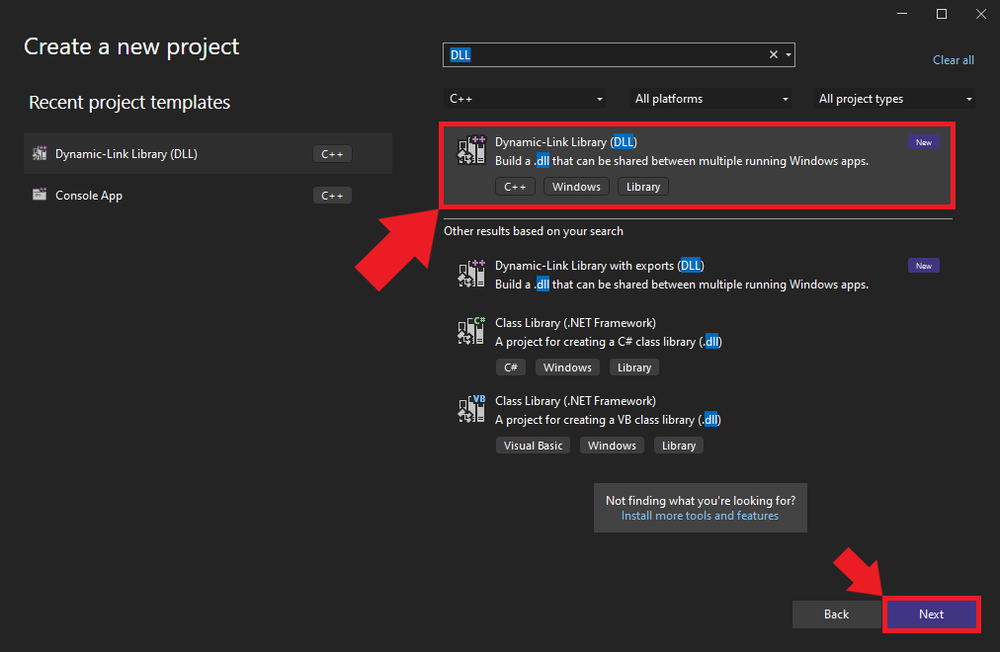
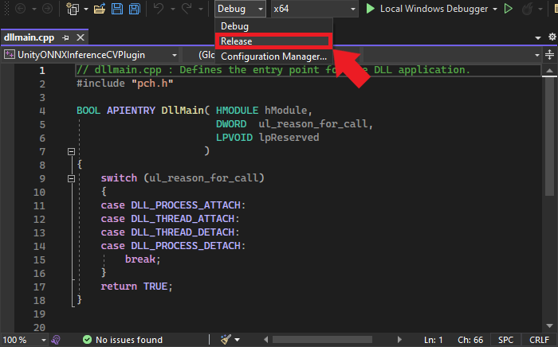
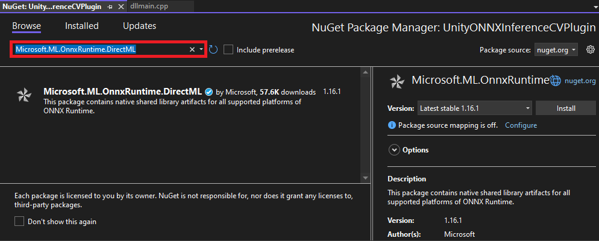
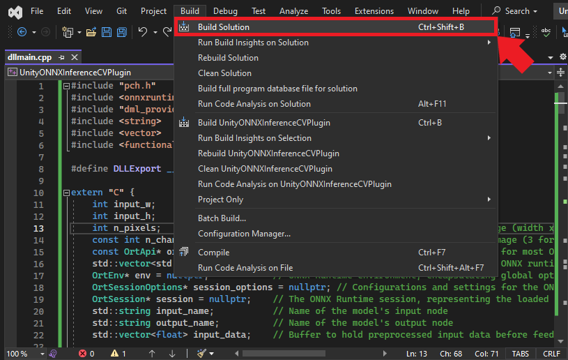
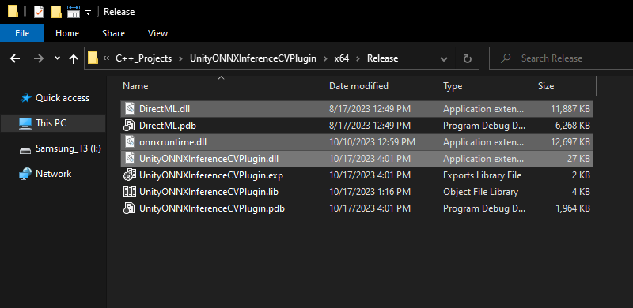

::: {.callout-tip}
## This post is part of the following series:
* [**ONNX Runtime in Unity**](/series/tutorials/onnx-runtime-unity-series.html)
:::


* [Introduction](#introduction)
* [Creating a Dynamic-Link Library Project](#creating-a-dynamic-link-library-project)
* [Configuring the Release Build](#configuring-the-release-build)
* [Installing ONNX Runtime via NuGet](#installing-onnx-runtime-via-nuget)
* [Including the ONNX Runtime Header Files](#including-the-onnx-runtime-header-files)
* [Preparing Functions for Export and Preventing Name Mangling](#preparing-functions-for-export-and-preventing-name-mangling)
* [Declaring Global Variables](#declaring-global-variables)
* [Defining Utility Functions](#defining-utility-functions)
* [Loading a Model](#loading-a-model)
* [Performing Inference](#performing-inference)
* [Building the Project](#building-the-project)
* [Conclusion](#conclusion)


## Introduction

In this tutorial, we'll create a native plugin for the Unity game engine that leverages ONNX Runtime for computer vision tasks. ONNX (Open Neural Network Exchange) Runtime is a high-performance, cross-platform engine that allows developers to run standardized machine learning models. Leveraging ONNX Runtime for computer vision in Unity applications will unlock many potential applications for users and developers.

I'll guide you step-by-step, from setting up a Visual Studio environment to compiling the project as a DLL. In a [follow-up post](./unity-integration), we'll implement a simple Unity scene where we will use our plugin to perform object detection with a YOLOX model. The sample Unity project is available on GitHub at the link below:

- [unity-onnxruntime-inference-yolox-demo](https://github.com/cj-mills/unity-onnxruntime-inference-yolox-demo)

By the end of this tutorial, you'll have a plugin for using ONNX Runtime to run a wide range of computer vision models in Unity projects.


::: {.callout-important}
This post assumes [Visual Studio](https://visualstudio.microsoft.com/downloads/) is present on your system and has the `Desktop Development with C++` workload installed.
:::


## Creating a Dynamic-Link Library Project

In this section, we initialize a C++ DLL project in Visual Studio.

### Launching Visual Studio

Begin by opening Visual Studio. On the welcome screen, locate the `Get started` section and choose `Create a new project`.

{fig-align="center"}


### Selecting the Project Type

We’ll use the C++ `Dynamic-Link Library (DLL)` template for our project. Select the template from the list and click `Next` to proceed.

{fig-align="center"}


### Naming and Locating Your Project

Choose an appropriate name and location for the project and click the `Create` button. By default, the `.dll` file will use the project name.


{fig-align="center"}


## Configuring the Release Build

Once the project opens in Visual Studio, we must configure it for a `Release` build. At the top of the window, open the Solution  Configurations dropdown menu and select `Release`.


{fig-align="center"}


## Installing ONNX Runtime via NuGet

With the project configured, it's time to install ONNX Runtime. For this tutorial, we will install ONNX Runtime with the DirectML execution provider. DirectML is a high-performance, hardware-accelerated DirectX 12 library for machine learning on Windows. It provides GPU acceleration for machine learning tasks across a broad range of supported hardware and drivers.

We can install ONNX Runtime with DirectML directly into our project via the [NuGet](https://www.nuget.org/) package manager integrated with Visual Studio. 


### Accessing NuGet Packages in Visual Studio

Open the `Project` menu and select `Manage NuGet Packages...` from the dropdown menu.

{fig-align="center"}


### Searching for the ONNX Runtime Package
Within the NuGet tab, select the `Browse` option and enter `Microsoft.ML.OnnxRuntime.DirectML` into the search box.

{fig-align="center"}

### Installing the Package
Select the appropriate package from the search results. For this tutorial, we'll be using version `1.16.1`. Click on the `Install` button to add it to your project.

{fig-align="center"}


### Confirming the Installation
A confirmation popup will appear detailing the pending changes to the project. Review these and then click `Apply` to proceed.

{fig-align="center"}


## Including the ONNX Runtime Header Files

Now that we have ONNX Runtime installed, it's time to dive into the code. First, we must include the header files for ONNX Runtime and the DirectML extension to access their functionality.

Remove the default code after the `#include "pch.h"` line and add the following lines at the top of the dllmain.cpp file:

```c++
#include <onnxruntime_cxx_api.h>
#include "dml_provider_factory.h"
#include <string>
#include <vector>
#include <functional>
```


1. `<onnxruntime_cxx_api.h>`: This header provides the primary C++ API definitions for ONNX Runtime, giving us access to core functionalities like sessions, input and output binding, etc.
2. `"dml_provider_factory.h"`: This header is specifically for the DirectML execution provider. It facilitates GPU acceleration via DirectML.

The rest of the headers are from the C++ standard library.


## Preparing Functions for Export and Preventing Name Mangling

Before getting further into our plugin's logic, we must set some groundwork to ensure smooth interoperability between our C++ code and Unity, which uses C#.

### Creating an Export Macro
When developing a DLL for Unity, we need a mechanism to specify which functions are available for external use. In C++, we can accomplish this by marking them with the `__declspec(dllexport)` directive. To streamline this process, we can define a macro:

```c++
#define DLLExport __declspec(dllexport)
```

By prefixing a function with `DLLExport`, we signal that it's available for Unity to call.


### Preventing Name Mangling
C++ compilers often modify function names as part of the compilation process—a mechanism known as "name mangling." Name mangling can make it challenging for other software (like Unity) to locate and call the functions.

We can prevent name mangling by wrapping our code within an `extern "C"` block. This wrapper tells the compiler not to mangle the names of the contained functions, preserving their original signatures:

```c++
extern "C" {
    // Your function declarations and definitions will go here...
}
```


All subsequent code—including global variable declarations, utility functions, and the core logic of our plugin—should reside within this `extern "C"` block to ensure they remain accessible and free from name-mangling complications.


With these preparations in place, we're ready to dive into the specifics of our plugin, starting with global variable declarations.


## Declaring Global Variables

Since we are making a plugin, we want to make our variables global so the functions we call through Unity can access them. Here are the variables we'll need for our plugin:

```c++
int input_w;                      // Width of the input image
int input_h;                      // Height of the input image
int n_pixels;                     // Total number of pixels in the input image (width x height)
const int n_channels = 3;         // Number of color channels in the input image (3 for RGB)
const OrtApi* ort = nullptr;      // Pointer to the ONNX Runtime C API, used for most ONNX operations
std::vector<std::string> provider_names; // Names of providers available for ONNX runtime, e.g., DirectML
OrtEnv* env = nullptr;            // ONNX Runtime environment, encapsulating global options and logging functionality
OrtSessionOptions* session_options = nullptr; // Configurations and settings for the ONNX session
OrtSession* session = nullptr;    // The ONNX Runtime session, representing the loaded model and its state
std::string input_name;           // Name of the model's input node
std::string output_name;          // Name of the model's output node
std::vector<float> input_data;    // Buffer to hold preprocessed input data before feeding it to the model
```


These global variables serve various purposes:

- `input_w` and `input_h` will define the dimensions of our input images.
- `n_pixels` provides a quick reference to the number of pixels.
- ONNX Runtime-related variables (`ort`, `env`, `session_options`, `session`) are for managing the model and performing inference.
- `input_name` and `output_name` will specify which nodes of the model we're interfacing with.
- `input_data` provides a buffer to handle the preprocessed data, ready to be ingested by our machine-learning model.

With our global variables declared, we can start defining the functions for the plugin.


## Defining Utility Functions

In this section, we will define several utility functions that will aid in initializing the ONNX Runtime, converting strings, querying available providers, and cleaning up resources.

### String Conversion
Certain Windows APIs and functions expect wide strings (`wstring`) as arguments. In our case, we need to convert the string file path for the ONNX model when creating an Inference Session. We'll perform this step in a dedicated function:

```c++
/// <summary>
/// Convert a standard string to a wide string.
/// </summary>
/// <param name="str">A standard string to convert.</param>
/// <returns>The wide string representation of the given string.</returns>
std::wstring stringToWstring(const std::string& str) {
	std::wstring wstr(str.begin(), str.end());
	return wstr;
}
```


### Initializing ONNX Runtime
We need to initialize a pointer to access the ONNX Runtime API. Once we can access the API, we'll get the available execution providers. By default, there should always be a CPU execution provider. There may be additional execution providers available depending on which NuGet package we install, like the one we selected for DirectML.

```c++
/// <summary>
/// Initialize the ONNX Runtime API and retrieve the available providers.
/// </summary>
/// <returns></returns>
DLLExport void InitOrtAPI() {
	// Get the ONNX Runtime API
	ort = OrtGetApiBase()->GetApi(ORT_API_VERSION);

	// Temporary pointers to fetch provider names
	char** raw_provider_names;
	int provider_count;

	// Get available providers
	ort->GetAvailableProviders(&raw_provider_names, &provider_count);

	// Populate the global provider names vector
	provider_names = std::vector<std::string>(raw_provider_names, raw_provider_names + provider_count);
}
```


### Getting the Number of Providers
We will likely want to know how many execution providers are available for the plugin inside a Unity application. This function allows us to get the number of available execution providers within Unity:

```c++
/// <summary>
/// Get the number of available execution providers.
/// </summary>
/// <returns>The number of execution providers.</returns>
DLLExport int GetProviderCount() {
	return static_cast<int>(provider_names.size());
}
```


### Retrieving a Provider Name
Once we have the number of available execution providers inside Unity, we can index into the `vector` that stores the provider names and return the values to Unity.

```c++
/// <summary>
/// Retrieve the name of a specific execution provider.
/// </summary>
/// <param name="index">The index of the provider.</param>
/// <returns>The name of the provider or nullptr if index is out of bounds.</returns>
DLLExport const char* GetProviderName(int index) {
	if (index >= 0 && index < provider_names.size()) {
		return provider_names[index].c_str();
	}
	return nullptr;
}
```


### Cleaning Up Resources
We will allocate system memory for various resources while using the plugin. It's a good practice to free these resources when they're no longer needed.

```c++
/// <summary>
/// Release allocated ONNX Runtime resources.
/// </summary>
/// <returns></returns>
DLLExport void FreeResources() {
	if (session) ort->ReleaseSession(session);
	if (env) ort->ReleaseEnv(env);
}
```


## Loading a Model

Next, we will cover creating an Inference Session using information passed in from a Unity application.

### The `LoadModel` Function
This function will take a model path, an execution provider name, and the expected image dimensions. It handles the necessary steps to prepare the ONNX Runtime environment, load the model, and store some essential metadata:

```c++
/// <summary>
/// Load an ONNX model and prepare it for inference.
/// </summary>
/// <param name="model_path">Path to the ONNX model file.</param>
/// <param name="execution_provider">The execution provider to use (e.g., "CPU" or "Dml").</param>
/// <param name="image_dims">Dimensions of the input image [width, height].</param>
/// <returns>A message indicating the success or failure of the loading process.</returns>
DLLExport const char* LoadModel(const char* model_path, const char* execution_provider, int image_dims[2]) {
	try {
		// Define an instance name for the session
		std::string instance_name = "inference-session";

		// Create an ONNX Runtime environment with a given logging level
		ort->CreateEnv(ORT_LOGGING_LEVEL_WARNING, instance_name.c_str(), &env);

		// Disable telemetry events
		ort->DisableTelemetryEvents(env);

		// Create session options for further configuration
		ort->CreateSessionOptions(&session_options);

		// Define the execution provider
		std::string provider_name = execution_provider;

		// Map execution providers to specific actions (e.g., settings for DML)
		std::unordered_map<std::string, std::function<void()>> execution_provider_actions = {
			{"CPU", []() {}},  // No special settings for CPU
			{"Dml", [&]() {   // Settings for DirectML (DML)
				ort->DisableMemPattern(session_options);
				ort->SetSessionExecutionMode(session_options, ExecutionMode::ORT_SEQUENTIAL);
				OrtSessionOptionsAppendExecutionProvider_DML(session_options, 0);
			}}
		};

		// Apply the settings based on the chosen execution provider
		bool action_taken = false;
		for (const auto& pair : execution_provider_actions) {
			const auto& key = pair.first;
			const auto& action = pair.second;

			if (provider_name.find(key) != std::string::npos) {
				action();
				action_taken = true;
				break;
			}
		}

		if (!action_taken) {
			return "Unknown execution provider specified.";
		}

		// Load the ONNX model
		ort->CreateSession(env, stringToWstring(model_path).c_str(), session_options, &session);
		ort->ReleaseSessionOptions(session_options);

		// Set up an allocator for retrieving input-output names
		Ort::AllocatorWithDefaultOptions allocator;

		char* temp_input_name;
		ort->SessionGetInputName(session, 0, allocator, &temp_input_name);
		input_name = temp_input_name;

		char* temp_output_name;
		ort->SessionGetOutputName(session, 0, allocator, &temp_output_name);
		output_name = temp_output_name;

		// Store image dimensions and prepare the input data container
		input_w = image_dims[0];
		input_h = image_dims[1];
		n_pixels = input_w * input_h;
		input_data.resize(n_pixels * n_channels);

		return "Model loaded successfully.";
	}
	catch (const std::exception& e) {
		// Handle standard exceptions and return their messages
		return e.what();
	}
	catch (...) {
		// Handle all other exceptions
		return "An unknown error occurred while loading the model.";
	}
}
```

The function sets up the ONNX Runtime environment based on the specified execution provider. It then loads the model, fetches the names of input and output tensors, and prepares the input data structure. Proper exception handling ensures that any issues encountered get passed back to the Unity application.


## Performing Inference

Once the ONNX model is loaded, the next step is to use this model for inference. Inference refers to inputting data (in our case, an image) into the model and obtaining the predicted output.

### The `PerformInference` Function
This function carries out the steps of preprocessing the input image, performing inference, and then storing the raw output in an array passed from Unity:

```c++
/// <summary>
/// Perform inference using the loaded ONNX model.
/// </summary>
/// <param name="image_data">Raw image data as bytes.</param>
/// <param name="output_array">Array to store the inferred results.</param>
/// <param name="length">Length of the output_array.</param>
/// <returns></returns>
DLLExport void PerformInference(byte* image_data, float* output_array, int length) {

	// Preprocessing: Normalize and restructure the image data
	for (int p = 0; p < n_pixels; p++) {
		for (int ch = 0; ch < n_channels; ch++) {
			// Normalize pixel values to [0, 1] and reorder channels
			input_data[ch * n_pixels + p] = (image_data[p * n_channels + ch] / 255.0f);
		}
	}

	// Define the names of input and output tensors for inference
	const char* input_names[] = { input_name.c_str() };
	const char* output_names[] = { output_name.c_str() };

	// Define the shape of the input tensor
	int64_t input_shape[] = { 1, 3, input_h, input_w };

	// Create a memory info instance for CPU allocation
	OrtMemoryInfo* memory_info;
	ort->CreateCpuMemoryInfo(OrtArenaAllocator, OrtMemTypeDefault, &memory_info);

	// Convert the processed image data into an ONNX tensor format
	OrtValue* input_tensor = nullptr;
	ort->CreateTensorWithDataAsOrtValue(
		memory_info, input_data.data(), input_data.size() * sizeof(float),
		input_shape, 4, ONNX_TENSOR_ELEMENT_DATA_TYPE_FLOAT, &input_tensor
	);

	// Free the memory info after usage
	ort->ReleaseMemoryInfo(memory_info);

	// Perform inference using the ONNX Runtime
	OrtValue* output_tensor = nullptr;
	ort->Run(session, nullptr, input_names, (const OrtValue* const*)&input_tensor, 1, output_names, 1, &output_tensor);

	// If inference fails, release resources and return
	if (!output_tensor) {
		ort->ReleaseValue(input_tensor);
		return;
	}

	// Extract data from the output tensor
	float* out_data;
	ort->GetTensorMutableData(output_tensor, (void**)&out_data);

	// Copy the inference results to the provided output array
	std::memcpy(output_array, out_data, length * sizeof(float));

	// Release resources associated with the tensors
	ort->ReleaseValue(input_tensor);
	ort->ReleaseValue(output_tensor);
}
```


That takes care of the code for our plugin. In the next section, we will compile our project as a DLL.


## Building the Project

Now that we've completed the code for the plugin, we are ready to build our project. Follow the steps below to compile the DLL.

### Compiling the Code
Open the Build menu at the top of the Visual Studio window and click Build Solution. This action will compile the project and generate the necessary output files in the project directory. Visual Studio will create a new `x64` folder in the project directory containing the DLL files.

{fig-align="center"}

### Accessing the Build Output
To locate the compiled application, right-click the project name in the `Solution Explorer` panel and select `Open Folder in File Explorer` from the popup menu.


{fig-align="center"}


In the new File Explorer window, go to the parent folder and open the `x64 → Release` subfolder. Here, we should see the following DLL files:

- `DirectML.dll`
- `onnxruntime.dll`
- `UnityONNXInferenceCVPlugin.dll`

{fig-align="center"}

We'll need to copy the three DLL files in the Release folder into a Unity project's `Assets/Plugings/x86_64` folder.


## Conclusion

Congratulations on building an ONNX Runtime plugin for Unity! The combination of Unity and ONNX opens up many possibilities, from AR/VR applications with real-time object recognition to simulations with dynamic behavior influenced by neural network outputs.

Remember, this guide is just the foundation. You may need to expand and customize the functionalities of this plugin further for more advanced projects.

Check out the [follow-up post](./unity-integration) to learn how to integrate the plugin into a Unity project to perform real-time object detection with a YOLOX model.


## Recommended Tutorials

* [**Real-Time Object Detection in Unity with ONNX Runtime and DirectML**](./unity-integration/): Learn how to integrate a native plugin in the Unity game engine to perform real-time object detection with ONNX Runtime. 






