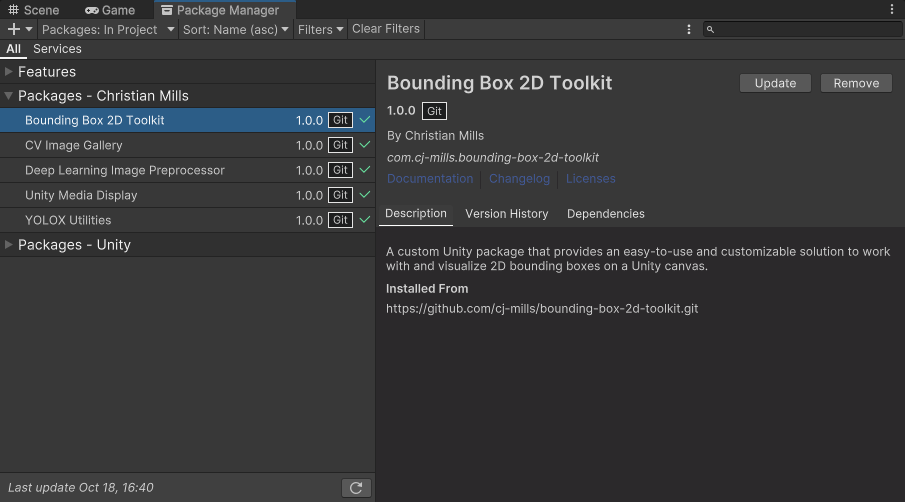

::: {.callout-tip}
## This post is part of the following series:
* [**ONNX Runtime in Unity**](/series/tutorials/onnx-runtime-unity-series.html)
:::


* [Introduction](#introduction)
* [Setting Up the Starter Project](#setting-up-the-starter-project)
* [Importing Plugin Assets](#importing-plugin-assets)
* [Installing Unity Package Dependencies](#installing-unity-package-dependencies)
* [Making DirectML Accessible to the Editor](#making-directml-accessible-to-the-editor)
* [Importing Plugin Functions](#importing-plugin-functions)
* [Performing Inference with the Plugin](#performing-inference-with-the-plugin)
* [Setting Up the Demo Scene](#setting-up-the-demo-scene)
* [Conclusion](#conclusion)


## Introduction

Welcome back to this series on creating plugins for the Unity game engine with ONNX Runtime! [Previously](../), we created a simple plugin for performing inference on RGB images in Visual Studio. This tutorial builds on that by showing how to integrate the plugin into a Unity project to perform real-time object detection.


::: {.callout-important}
This post assumes [Unity](https://unity.com/download) is present on your system.
:::


## Setting Up the Starter Project

To keep the focus for this tutorial on integrating the ONNX Runtime plugin, I created a starter Unity project for us to build on. This project simplifies testing various computer vision models using sample images and live webcam feeds.

::: {.callout-note}
The starter project uses [Unity 2023.1.14](unityhub://2023.1.14f1/9492f7722ddd), but the latest LTS release should work fine.
:::

### Obtaining the Starter Project

The starter project is available on GitHub at the link below:

- [unity-2d-cv-tutorial-starter](https://github.com/cj-mills/unity-2d-cv-tutorial-starter)

There are two main ways to obtain the project:

1. **Clone with Git**: If you have [Git](https://git-scm.com/downloads) installed, you can clone the repository directly to your local machine using the command below:

	```bash
	git clone https://github.com/cj-mills/unity-2d-cv-tutorial-starter.git
	```

2. **Download ZIP**: Alternatively, on the GitHub repository page, you can choose the option to download the entire project as a ZIP file.

{fig-align="center"}


### Launching the Starter Project in Unity

#### Open the Project

Once you've secured a copy of the starter project, launch the Unity Editor and open the project.

#### Access the Sample Scene

Within the Unity Editor, navigate to the `Assets->Scenes` directory in the [Project Window](https://docs.unity3d.com/Manual/ProjectView.html). From there, double-click on the `SampleScene` to open it.

{fig-align="center"}

#### Preview the Scene

Press the `Play` button to enter Play mode. If everything works correctly, you should see something like the image below in the [Game view](https://docs.unity3d.com/Manual/GameView.html).

{fig-align="center"}

#### Exit Play Mode

Once you've confirmed the sample scene is operational, click the `Play` button again to exit play mode. Our starter project is now ready, and we can proceed to integrate the ONNX Runtime plugin.


## Importing Plugin Assets

Now that we've initialized our Unity project, the next step is to import the assets required for our ONNX Runtime plugin.

### Setting Up Plugin Directories

#### Creating the `Plugins` Directory

Within the Unity Editor, navigate to the Assets folder and create a new folder named `Plugins`.

{fig-align="center"}


#### Adding the `x86_64` Directory

Inside the `Plugins` folder, create another folder titled `x86_64`. This folder will house the necessary DLL files for our plugin.


### Importing the DLL Files

If you don't have the DLL files from the previous tutorial, download them from the links below:

- [DirectML.dll](https://github.com/cj-mills/unity-onnxruntime-inference-yolox-demo/raw/main/Assets/Plugins/x86_64/DirectML.dll)
- [onnxruntime.dll](https://github.com/cj-mills/unity-onnxruntime-inference-yolox-demo/raw/main/Assets/Plugins/x86_64/onnxruntime.dll)
- [UnityONNXInferenceCVPlugin.dll](https://github.com/cj-mills/unity-onnxruntime-inference-yolox-demo/raw/main/Assets/Plugins/x86_64/UnityONNXInferenceCVPlugin.dll)

After obtaining the DLL files, drag and drop them into the `x86_64` directory inside Unity.

{fig-align="center"}

Close and reopen your Unity project once you've imported the DLL files. This step ensures Unity recognizes and registers the new plugin files.


### Importing the ONNX Model and Assets

#### Download the YOLOX Model and Colormap

For demonstration purposes, we'll use a YOLOX Tiny model that detects various hand gestures created using the following tutorial:

- [Training YOLOX Models for Real-Time Object Detection in PyTorch](https://christianjmills.com/series/tutorials/pytorch-train-object-detector-yolox-series.html)

Download the pre-trained model and its associated colormap using the links below:

- [hagrid-sample-30k-384p-yolox_tiny.onnx](https://huggingface.co/cj-mills/yolox-hagrid-onnx/resolve/main/yolox_tiny/hagrid-sample-30k-384p-yolox_tiny.onnx)
- [hagrid-sample-30k-384p-colormap.json](https://huggingface.co/cj-mills/yolox-hagrid-onnx/resolve/main/hagrid-sample-30k-384p-colormap.json)
  - (To save the colormap file, right-click the link and opt for `Save Link As...`)

#### Import Colormap File

Return to the Unity Editor and, under the Assets folder, create a new folder called Colormaps. Transfer the downloaded JSON colormap file into this directory.

{fig-align="center"}

#### Import the ONNX Model

Since Unity doesn't inherently recognize ONNX files, we must store them as [streaming assets](https://docs.unity3d.com/Manual/StreamingAssets.html). Create a folder called `StreamingAssets` within the Assets directory. Inside the `StreamingAssets` folder, create another folder named `Models`. Place the ONNX model you downloaded here.

{fig-align="center"}

That takes care of the required asset files.


## Installing Unity Package Dependencies

Before we dive into the code for our Unity project, we will install a package I made that provides utility functions for extracting bounding box proposals from the raw output of our YOLOX model:

| Package                                                      | Code Walkthrough                                   | Git URL                                             |
| ------------------------------------------------------------ | -------------------------------------------------- | --------------------------------------------------- |
| [Unity YOLOX Utilities](https://github.com/cj-mills/unity-yolox-utils) | [Blog Post](/posts/unity-yolox-utils-walkthrough/) | `https://github.com/cj-mills/unity-yolox-utils.git` |


### Installing the Package

We can install this package from the [Package Manager window](https://docs.unity3d.com/Manual/upm-ui.html).

#### Open the Package Manager

In the Unity Editor, navigate to the top menu and select `Window -> Package Manager`.

{fig-align="center"}

#### Add the Package

Click the add  button in the top left corner of the Package Manager window and select the `Install package from git URL...` option from the dropdown menu. 

{fig-align="center"}

Enter the git URL for the package and click `Install`. 

```bash
https://github.com/cj-mills/unity-yolox-utils.git
```

{fig-align="center"}


You may notice the package automatically installs another package called [`Bounding Box 2D Toolkit`](https://github.com/cj-mills/unity-bounding-box-2d-toolkit). This package provides functionality for working with and visualizing 2D bounding boxes on a Unity canvas.

{fig-align="center"}

That's it for the package dependencies. In the next section, we will dive into the code for our project.


## Making DirectML Accessible to the Editor

While the DLL files for our plugin and ONNX Runtime work fine in Unity's default plugins folder, the file for DirectML must be in the same folder as the current application's executable. Since we are in the Editor, we must store a copy of the DirectML DLL file in the folder for the Editor application. We can create a script to handle this automatically.

Create a new Assets folder called `Editor`. Inside the `Editor` folder, create a new C# script named `DirectMLDllCopier`. This script will only run while we are in the Unity Editor.

{fig-align="center"}

Open the script and replace the default content with the following code:

```c#
using System.IO;
using UnityEditor;

[InitializeOnLoad]
public class DirectMLDllCopier
{
    static DirectMLDllCopier()
    {
        CopyDirectMLDllToEditorDirectory();
    }

    private static void CopyDirectMLDllToEditorDirectory()
    {
        // Get all files named "DirectML.dll" in the Assets directory
        string[] files = Directory.GetFiles("./Assets/", "DirectML.dll", SearchOption.AllDirectories);
        // Iterate through each found file
        foreach (string file in files)
        {
            // Check if the file is in the "x86_64" folder
            if (file.Contains("x86_64"))
            {
                // Get the file path for the Editor application
                string editorPath = EditorApplication.applicationPath;
                // Extract the parent folder for the Editor application
                string editorDir = Directory.GetParent(editorPath).ToString();
                // Define target file path
                string targetPath = $"{editorDir}/DirectML.dll";
                // Only copy the file to the Editor application folder if it is not already present
                if (!File.Exists(targetPath)) File.Copy(file, targetPath);
            }
        }
    }
}
```


We use the [InitializeOnLoad](https://docs.unity3d.com/ScriptReference/InitializeOnLoadAttribute.html) attribute to have the Editor run this script whenever Unity loads or scripts recompile. That way, we can ensure the Editor has a copy of the DirectML file even when we change Unity versions.

Save the script and go back to the Editor. Doing so will cause the script to execute and copy the DirectML DLL file to the folder for the current Editor version.


{fig-align="center"}

Relaunch the Editor to ensure it loads with the DirectML file.


## Importing Plugin Functions

Now that Unity can access DirectML, we will create a script that imports the plugin functions, allowing us to access them in other C# scripts.

Create a new C# script inside the `Assets->Scripts` folder named `ONNXRuntimePluginImporter`.

{fig-align="center"}

Open the script and replace the default content with the following code:

```c#
using System;
using System.Runtime.InteropServices;

/// <summary>
/// Class with Native plugin functions for ONNX Runtime.
/// </summary>
public static class ONNXRuntimePluginImporter
{
    // Name of the DLL file
    const string dll = "UnityONNXInferenceCVPlugin";

    [DllImport(dll)]
    public static extern int InitOrtAPI();

    [DllImport(dll)]
    public static extern int GetProviderCount();

    [DllImport(dll)]
    public static extern IntPtr GetProviderName(int index);

    [DllImport(dll)]
    public static extern void FreeResources();

    [DllImport(dll)]
    public static extern IntPtr LoadModel(string model, string execution_provider, int[] inputDims);

    [DllImport(dll)]
    public static extern void PerformInference(byte[] inputData, float[] outputArray, int length);
}
```

We use the [`DllImport`](https://learn.microsoft.com/en-us/dotnet/api/system.runtime.interopservices.dllimportattribute) attribute from the `.NET` [`System.Runtime.InteropServices`](https://learn.microsoft.com/en-us/dotnet/api/system.runtime.interopservices) namespace to indicate the methods are from a DLL. Note we specify [`IntPtr`](https://learn.microsoft.com/en-us/dotnet/api/system.intptr) as the return value for methods that return a string.


## Performing Inference with the Plugin

Now that we've imported the plugin functionality, we can create a script to handle performing inference. Inside the Scripts folder, create a new C# script named `InferenceController`.

{fig-align="center"}


### Importing Namespace Dependencies

Inside the `InferenceController` script, we'll first update the namespace dependencies:

```c#
using UnityEngine;
using UnityEngine.Rendering;
using System.Collections.Generic;
using System.IO;
using System.Runtime.InteropServices;
using System;
using CJM.BBox2DToolkit;
using CJM.DeepLearningImageProcessor;
using CJM.YOLOXUtils;
```

- `UnityEngine.Rendering`: Provides access to the elements of the rendering pipeline.
- `System.IO`: Allows reading and writing to files and data streams.
- `System.Runtime.InteropServices`: Provides a variety of members that support [COM interop](https://learn.microsoft.com/en-us/dotnet/standard/native-interop/cominterop) and [platform invoke](https://learn.microsoft.com/en-us/dotnet/standard/native-interop/pinvoke) services.
- `CJM.BBox2DToolkit`: Provides an easy-to-use and customizable solution to work with and visualize 2D bounding boxes on a Unity canvas. 
- `CJM.DeepLearningImageProcessor`: Provides Shaders and Compute Shaders for various image processing tasks, such as cropping, normalizing, and flipping images in Unity.
- `CJM.YOLOXUtils`: Provides utility functions to work with YOLOX object detection models in Unity. 


### Declaring Serialized Fields

Next, we will declare the variables we want to make accessible through the [Inspector window](https://docs.unity3d.com/Manual/UsingTheInspector.html) in Unity Editor.

#### GameObject Components

```c#
[Header("Components")]
[SerializeField, Tooltip("Responsible for image preprocessing")]
private ImageProcessor imageProcessor;
[SerializeField, Tooltip("Visualizes detected object bounding boxes")]
private BoundingBox2DVisualizer boundingBoxVisualizer;
[SerializeField, Tooltip("Renders the input image on a screen")]
private MeshRenderer screenRenderer;
```

- **`imageProcessor`**: This component is responsible for the necessary image preprocessing operations before we feed to the ONNX model.
- **`boundingBoxVisualizer`**: The YOLOX model predicts coordinates and dimensions for bounding boxes that contain detected objects in the input image. This component handles visualizing these boxes on the screen, allowing users to see the locations of detected objects within the image.
- **`screenRenderer`**: This renders the input image on a screen or a canvas in the Unity environment. It helps users see the original image alongside any visualized detections or annotations.

#### Data Processing Settings

```c#
[Header("Data Processing")]
[Tooltip("The target dimensions for the processed image")]
[SerializeField] private int targetDim = 224;
[Tooltip("Flag to normalize input images before passing them to the model.")]
[SerializeField] private bool normalizeInput = false;
[Tooltip("Flag to flip input images around the X-axis before passing them to the model.")]
[SerializeField] private bool flipInput = false;
[SerializeField, Tooltip("Flag to enable/disable async GPU readback for the input image")]
private bool useAsyncGPUReadback = false;
```

- **`targetDim`**: This field specifies the desired height of input images.
- **`normalizeInput`**: Normalization is a common preprocessing step that involves scaling the pixel values of an image to a standard range. It helps in maintaining consistency and can affect the model's performance. Our model performs this step internally, but others might not.
- **`flipInput`**: The input image gets flipped upside down when it goes to the plugin. We can pre-flip it in a [Compute Shader](https://docs.unity3d.com/Manual/class-ComputeShader.html) to ensure it is right-side up when we feed it to the model.
- **`useAsyncGPUReadback`**: We need to download the pixel data for the input image from the GPU to system memory before sending it to the plugin. This download process can cause a significant performance bottleneck as it waits for the GPU to complete all previous work. We mitigate the performance hit by downloading the pixel data asynchronously. This approach can significantly improve frame rates at the cost of some latency.

#### Output Processing Settings

```c#
[Header("Output Processing")]
[SerializeField, Tooltip("Minimum confidence score for an object proposal to be considered"), Range(0, 1)]
private float confidenceThreshold = 0.5f;
[SerializeField, Tooltip("Threshold for Non-Maximum Suppression (NMS)"), Range(0, 1)]
private float nmsThreshold = 0.45f;
[SerializeField, Tooltip("JSON file with bounding box colormaps")]
private TextAsset colormapFile;
```

- **`confidenceThreshold`**: The YOLOX model assigns a confidence score to each detected object. This threshold ensures we only keep detections with a confidence score above the specified value. It helps in reducing false positives.
- **`nmsThreshold`**: Non-maximum suppression (NMS) is a technique used to ensure that a single object doesn't get detected multiple times with overlapping boxes. The threshold determines how much overlap to tolerate before ignoring a detection.
- **`colormapFile`**: We can access the JSON colormap file we imported early as a Unity [TextAsset](https://docs.unity3d.com/ScriptReference/TextAsset.html).

#### ONNX

```c#
[Header("ONNX")]
[Tooltip("The name of the ONNX models folder")]
public string onnxModelsDir = "Models";
```

- **`onnxModelsDir`**: This field specifies the name of the directory in the StreamingAssets folder we used to store the ONNX model.


### Declaring Private Variables

After that, we can define the private variables we want to remain internal to the script.

#### Bounding Box Information

```c#
private BBox2DInfo[] bboxInfoArray; // Array to store bounding box information
```

- **`bboxInfoArray`**: Stores information related to detected objects' bounding boxes and their associated label and color from the colormap.

#### Screen Properties

```c#
private bool mirrorScreen = false; // Flag to check if the screen is mirrored
```

- **`mirrorScreen`**: A flag that tracks whether the screen is mirrored or not. We need to know this when processing the predicted bounding boxes.

#### Image Processing

```c#
private Vector2Int offset; // Offset used when cropping the input image
Texture2D inputTextureCPU;  // The model CPU input texture
```

- **`offsets`**: We need to ensure the input image dimensions are multiples of 32. We do this by cropping the resized input image. This variable stores the distance in pixels from the top-left corner of the input image and the cropped area. We then use these offset values to adjust the predicted bounding box locations.
- **`inputTextureCPU`**: Stores the pixel data for the input image in system memory.

#### Color and Label Management

```c#
// List to store label and color pairs for each class
private List<(string, Color)> colormapList = new List<(string, Color)>();
```

* **`colormapList`**: We use this list to associate each detected object's class with the matching color and label from the colormap.

#### YOLOX Model Information

```c#
// List to store grid and stride information for the YOLOX model
private List<GridCoordinateAndStride> gridCoordsAndStrides = new List<GridCoordinateAndStride>();
private int proposalLength; // Length of the proposal array for YOLOX output
float[] outputArray; // Stores the raw model output
```

- **`gridCoordsAndStrides`**: Stores information related to the grid coordinates and strides for the YOLOX model, which we use for processing the model's raw output into usable bounding box data.
- **`proposalLength`**: Represents the length of a single object proposal from the YOLOX model's output.
- **`outputArray`**: A container that holds the raw output data from the YOLOX model.

#### ONNX Model Information

```c#
// File paths for the available ONNX models
private List<string> modelPaths = new List<string>();
// Names of the available ONNX models
private List<string> modelNames = new List<string>();
// Names of the available ONNX execution providers
private List<string> onnxExecutionProviders = new List<string>();
```

- **`modelPaths`**: Contains the file paths for all available ONNX models within the specified directory.
- **`modelNames`**: Holds the names of all available ONNX models. We can use this for display purposes or logging/debugging.
- **`onnxExecutionProviders`**: Lists the names of available execution providers for ONNX. In our case, there should be two: the CPU and DirectML execution providers.


### Defining Private Methods

Now, we can define the private methods for our script.

#### Prepare Input Textures

This method creates a temporary `RenderTexture` with the specified dimensions. We use this when setting up a texture for processing before sending it to the model, ensuring it matches the target input dimensions.

```c#
/// <summary>
/// Prepare a temporary RenderTexture with the given input dimensions.
/// </summary>
/// <param name="inputDims">The input dimensions for the RenderTexture</param>
/// <returns>A temporary RenderTexture with the specified input dimensions</returns>
private RenderTexture PrepareInputTexture(Vector2Int inputDims)
{
    return RenderTexture.GetTemporary(inputDims.x, inputDims.y, 0, RenderTextureFormat.ARGBHalf);
}
```


#### Process Input Images

This method takes in an input texture and applies a series of transformations, like cropping, normalization, and flipping.

```c#
/// <summary>
/// Process the input image and apply necessary transformations.
/// </summary>
/// <param name="inputTexture">The input RenderTexture to process</param>
/// <param name="imageTexture">The source image texture</param>
/// <param name="sourceDims">The source image dimensions</param>
/// <param name="inputDims">The input dimensions for processing</param>
private void ProcessInputImage(RenderTexture inputTexture, Texture imageTexture, Vector2Int sourceDims, Vector2Int inputDims)
{
    // Calculate the offset for cropping the input image
    offset = (sourceDims - inputDims) / 2;

    // Create a temporary render texture to store the cropped image
    RenderTexture sourceTexture = RenderTexture.GetTemporary(sourceDims.x, sourceDims.y, 0, RenderTextureFormat.ARGBHalf);
    Graphics.Blit(imageTexture, sourceTexture);

    // Crop and normalize the input image using Compute Shaders
    if (SystemInfo.supportsComputeShaders)
    {
        imageProcessor.CropImageComputeShader(sourceTexture, inputTexture, offset, inputDims);
        if (normalizeInput) imageProcessor.ProcessImageComputeShader(inputTexture, "NormalizeImage");
        if (flipInput) imageProcessor.ProcessImageComputeShader(inputTexture, "FlipXAxis");
    }

    // Release the temporary render texture
    RenderTexture.ReleaseTemporary(sourceTexture);
}
```


#### Update Bounding Boxes

This method adjusts the position and scale of the bounding boxes based on the processed input's dimensions and the screen's dimensions. We use this to ensure the bounding boxes correctly overlay on the displayed image, considering any transformations made during the image processing phase.

```c#
/// <summary>
/// Update the bounding boxes based on the input dimensions and screen dimensions.
/// </summary>
/// <param name="inputDims">The input dimensions for processing</param>
private void UpdateBoundingBoxes(Vector2Int inputDims)
{
    // Check if the screen is mirrored
    mirrorScreen = screenRenderer.transform.localScale.z == -1;

    // Get the screen dimensions
    Vector2 screenDims = new Vector2(screenRenderer.transform.localScale.x, screenRenderer.transform.localScale.y);

    // Scale and position the bounding boxes based on the input and screen dimensions
    for (int i = 0; i < bboxInfoArray.Length; i++)
    {
        bboxInfoArray[i].bbox = BBox2DUtility.ScaleBoundingBox(bboxInfoArray[i].bbox, inputDims, screenDims, offset, mirrorScreen);
    }
}
```


#### Get ONNX Models

This method scans the specified directory for available ONNX models and records their file paths and names. We can then pass a model path to the plugin to initialize an inference session.

```c#
/// <summary>
/// Get the file paths for available ONNX models
/// </summary>
private void GetONNXModels()
{
    // Get the paths for each model folder
    foreach (string file in Directory.GetFiles($"{Application.streamingAssetsPath}/{onnxModelsDir}"))
    {
        if (file.EndsWith(".onnx"))
        {
            // Extract the model folder name
            string modelName = file.Split('\\')[1].Split('.')[0];
            Debug.Log($"modelName: {modelName}");
            // Add name to list of model names
            modelNames.Add(modelName);
            modelPaths.Add(file);
        }
    }
}
```


#### Get ONNX Execution Providers

This method fetches the names of the available execution providers from the plugin. We can then choose which one to use for inference.

```c#
/// <summary>
/// Get the names of the available ONNX execution providers
/// </summary>
private void GetONNXExecutionProviders()
{
    // Get the number of available ONNX execution providers
    int providerCount = ONNXRuntimePluginImporter.GetProviderCount();
    Debug.Log($"Provider Count: {providerCount}");

    for (int i = 0; i < providerCount; i++)
    {
        string providerName = Marshal.PtrToStringAnsi(ONNXRuntimePluginImporter.GetProviderName(i));
        Debug.Log(providerName);
        providerName = providerName.Replace("ExecutionProvider", "");
        onnxExecutionProviders.Add(providerName);
    }
    onnxExecutionProviders.Reverse();
}
```


#### Update ONNX Model

This method loads the selected ONNX model with the specified execution provider and input dimensions. For a production application, you may want to provide options to switch between models and execution providers. For this demo, we'll hardcode using the first model found and the last execution provider in the list. In our case, that will be the DirectML provider.

```c#
/// <summary>
/// Update the selected ONNX model
/// </summary>
public void UpdateONNXModel()
{
    int[] inputDims = new int[] {
        inputTextureCPU.width,
        inputTextureCPU.height
    };

    // Load the specified ONNX model
    IntPtr resultPtr = ONNXRuntimePluginImporter.LoadModel(
        modelPaths[0],
        onnxExecutionProviders[1],
        inputDims);

    string return_msg = Marshal.PtrToStringAnsi(resultPtr); // Convert IntPtr to string

    Debug.Log($"Return message: {return_msg}");
}
```


#### Asynchronous GPU Readback

This method handles the completion of an asynchronous GPU readback request. It ensures the readback data correctly transfers to a Texture2D object and resolves potential errors and resizing issues.

```c#
private void OnCompleteReadback(AsyncGPUReadbackRequest request, Texture2D targetTexture, RenderTexture sourceTexture)
{
    if (request.hasError)
    {
        Debug.Log("GPU readback error detected.");
        return;
    }

    // Make sure the Texture2D is not null
    if (targetTexture)
    {
        // Check if dimensions of targetTexture and sourceTexture are different
        if (targetTexture.width != sourceTexture.width || targetTexture.height != sourceTexture.height)
        {
            // Re-create the Texture2D with the same dimensions as the RenderTexture
            targetTexture.Reinitialize(sourceTexture.width, sourceTexture.height);
            // It's usually a good idea to clear out any previous data after resizing
            targetTexture.Apply();
        }

        // Fill Texture2D with raw data from the AsyncGPUReadbackRequest
        targetTexture.LoadRawTextureData(request.GetData<uint>());
        // Apply changes to Texture2D
        targetTexture.Apply();
    }
}
```


### Defining Public Methods

We only have one public method, which handles changes to the confidence threshold from the GUI.

#### Update the Confidence Threshold

```c#
/// <summary>
/// Update the confidence threshold for object detection.
/// </summary>
/// <param name="value">The new confidence threshold value</param>
public void UpdateConfidenceThreshold(float value)
{
    confidenceThreshold = value;
}
```


### Defining MonoBehaviour Methods

Lastly, we will define the [`MonoBehaviour`](https://docs.unity3d.com/ScriptReference/MonoBehaviour.html) methods and implement the steps the script should execute when it's loading, before the first frame update, during each frame, and when the application closes.

#### Make DirectML Accessible to the Project Build

As mentioned earlier, the DirectML DLL file must be in the same directory as the application executable for us to use the DirectML execution provider. We've already addressed that for working in the Editor, and now we'll do the same for our compiled Unity project. 

When the compiled application runs outside the Editor, it will copy the DirectML DLL file from the plugins folder to the same directory as the executable file. We want to ensure this code runs before the rest of the script, so we'll place it in the [`Awake()`](https://docs.unity3d.com/ScriptReference/MonoBehaviour.Awake.html) method.

```c#
// Awake runs when the script instance is being loaded
private void Awake()
{
#if !UNITY_EDITOR
    // Define the path for the DirectML.dll file in the StreamingAssets folder
    string sourcePath = $"{Application.dataPath}/Plugins/x86_64/DirectML.dll";

    string dataPath = Application.dataPath;
    string buildDir = Directory.GetParent(dataPath).ToString();

    // Define the destination path for the DirectML.dll file
    string targetPath = $"{buildDir}/DirectML.dll";
    // Only copy the file if it is not already present at the destination
    if (!File.Exists(targetPath)) File.Copy(sourcePath, targetPath);
#endif
}
```

#### Initialize the Plugin and Colormap

We want to load the colormap and initialize the plugin before the first frame update. Therefore, we'll perform these steps in the [`Start()`](https://docs.unity3d.com/ScriptReference/MonoBehaviour.Start.html) method.

```c#
// Start is called before the first frame update
private void Start()
{
    colormapList = ColormapUtility.LoadColorMapList(colormapFile); // Load colormap information from JSON file
    proposalLength = colormapList.Count + YOLOXConstants.NumBBoxFields; // Calculate proposal length

    // Get the file paths for available ONNX models
    GetONNXModels();
    // Initialize the ONNX Runtime API
    ONNXRuntimePluginImporter.InitOrtAPI();
    // Get the names of available ONNX execution providers
    GetONNXExecutionProviders();
}
```


#### Perform Inference with the Plugin

The [`Update()`](https://docs.unity3d.com/ScriptReference/MonoBehaviour.Update.html) method orchestrates real-time object detection in each frame. 

First, it extracts the current frame's image data and applies the preprocessing steps. If the input dimensions change, the method updates the plugin with the new dimensions. 

We then download the pixel data for the input image from the GPU to the system memory, either asynchronously or synchronously, and pass it to the plugin for inference. 

The raw model output gets translated into potential bounding box proposals, which we further refine using Non-Maximum Suppression to eliminate redundant boxes. These proposals are then structured and filtered to offer actionable data, like object positions and labels. 

Finally, we pass the bounding boxes to the visualizer to display them on screen, showing the detected objects in real time.

```c#
/// <summary>
/// Update the InferenceController every frame, processing the input image and updating the UI and bounding boxes.
/// </summary>
private void Update()
{
    // Get the input image and dimensions
    var imageTexture = screenRenderer.material.mainTexture;
    var imageDims = new Vector2Int(imageTexture.width, imageTexture.height);
    var inputDims = imageProcessor.CalculateInputDims(imageDims, targetDim);

    // Calculate source and input dimensions for model input
    var sourceDims = inputDims;
    inputDims = YOLOXUtility.CropInputDims(inputDims);

    // Prepare and process the input texture
    RenderTexture inputTexture = PrepareInputTexture(inputDims);
    ProcessInputImage(inputTexture, imageTexture, sourceDims, inputDims);

	// Update the plugin with the current input dimensions
    if (!inputTextureCPU || inputTextureCPU.width != inputTexture.width || inputTextureCPU.height != inputTexture.height)
    {
        inputTextureCPU = new Texture2D(inputDims.x, inputDims.y, TextureFormat.RGB24, false);
        gridCoordsAndStrides = YOLOXUtility.GenerateGridCoordinatesWithStrides(YOLOXConstants.Strides, inputTexture.height, inputTexture.width);

        int output_size = gridCoordsAndStrides.Count * proposalLength;
        outputArray = new float[output_size];
        Debug.Log($"Updating output array to {output_size}");
        Debug.Log($"Input Dims: {inputTextureCPU.width}x{inputTextureCPU.height}");

        // Update the selected ONNX model
        UpdateONNXModel();
    }

    // Download the input image data from the GPU to system memory
    if (useAsyncGPUReadback)
    {
        AsyncGPUReadback.Request(inputTexture, 0, TextureFormat.RGB24, (request) =>
        {
            OnCompleteReadback(request, inputTextureCPU, inputTexture);
        });
    }
    else
    {
        // Download pixel data from GPU to CPU
        RenderTexture.active = inputTexture;
        inputTextureCPU.ReadPixels(new Rect(0, 0, inputTexture.width, inputTexture.height), 0, 0);
        inputTextureCPU.Apply();
    }

    // Pass the input image to the model and get the raw output
    ONNXRuntimePluginImporter.PerformInference(inputTextureCPU.GetRawTextureData(), outputArray, outputArray.Length);

    // Free the memory for the input RenderTexture
    RenderTexture.ReleaseTemporary(inputTexture);

    // Generate bounding box proposals from the output array
    List<BBox2D> proposals = YOLOXUtility.GenerateBoundingBoxProposals(outputArray,
                                                                       gridCoordsAndStrides,
                                                                       colormapList.Count,
                                                                       YOLOXConstants.NumBBoxFields,
                                                                       confidenceThreshold);

    // Apply Non-Maximum Suppression (NMS) to the proposals
    List<int> proposalIndices = BBox2DUtility.NMSSortedBoxes(proposals, nmsThreshold);
    // Create an array of BBox2DInfo objects containing the filtered bounding boxes, class labels, and colors
    bboxInfoArray = YOLOXUtility.GetBBox2DInfos(proposals, proposalIndices, colormapList);


    // Update bounding boxes and user interface
    UpdateBoundingBoxes(inputDims);
    boundingBoxVisualizer.UpdateBoundingBoxVisualizations(bboxInfoArray);
}
```


#### Clean Up Plugin Resources

The last piece of code to add will free the resources the plugin allocates when the application closes or when we exit play mode in the Editor.

```c#
private void OnApplicationQuit()
{
    ONNXRuntimePluginImporter.FreeResources();
}
```

That's it for the project code. All that's left is to set up the demo scene.


## Setting Up the Demo Scene

In this final section, we'll add the InferenceController script and a Bounding Box Visualizer to our demo scene.


### Adding the GameObjects

We'll first add the GameObjects for our InferenceController script and the Bounding Box Visualizer to the demo scene.

#### Create an Empty GameObject

Right-click an open space in the [Hierarchy window](https://docs.unity3d.com/Manual/Hierarchy.html) and select `Create Empty` from the popup menu.

{fig-align="center"}

Name the new object `InferenceManager`.

{fig-align="center"}


#### Add the Bounding Box Visualizer to the Scene
Next, go to the Project window and open the Packages->Bounding Box 2D Toolkit->Prefabs folder.


{fig-align="center"}


Select the BBox2DVisualizer prefab and drag it into the Hierarchy window.


{fig-align="center"}


### Configure Inference Manager

Now, we only need to configure the InferenceManager. With the InferenceManager object selected in the Hierarchy tab, drag the InferenceController script from the Assets folder to the [Inspector window](https://docs.unity3d.com/Manual/UsingTheInspector.html).

{fig-align="center"}


#### Add the Image Processor Component

Next, click the Add Component button in the Inspector window. Type Image Processor into the search box and press Enter.

{fig-align="center"}


#### Assign Inference Controller Components

Now, we can assign the ImageProcessor component to the InferenceController component.

{fig-align="center"}


After that, drag the BBox2DVisualizer from the Hierarchy window onto the Bounding Box Visualizer field in the InferenceController.


{fig-align="center"}


Next, drag the Screen object onto the Screen Render field.


{fig-align="center"}


Also, set the flags for flipping the input image and enabling asynchronous GPU readback.


{fig-align="center"}


Lastly, drag the Colormap file from the Assets folder into the Colormap File field.


{fig-align="center"}


### Test in Editor

We are finally ready to test our project. If you enter Play mode, you should see the following in the Game view:

{fig-align="center"}


## Conclusion

Congratulations on completing this tutorial! We previously created a native plugin in Visual Studio with ONNX Runtime and have now integrated it into a Unity project to perform real-time object detection. By now, you should have a firm grasp on how to embed a native plugin into the Unity game engine and leverage the power of ONNX Runtime for computer vision tasks.


