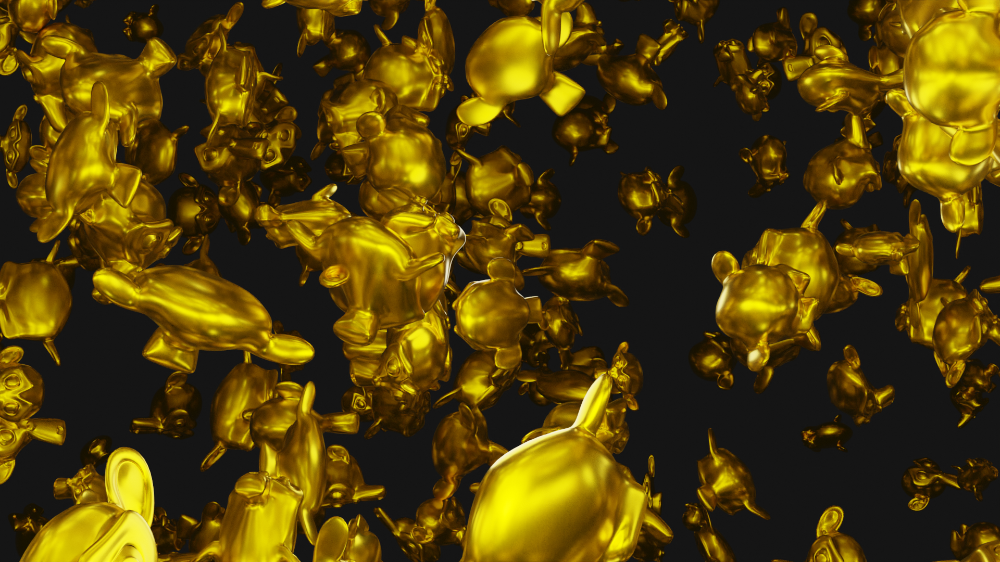

---
categories:
- recap
date: 2021-1-24
description: A summary of what I've been working on for the past couple weeks.
hide: false
layout: post
search_exclude: false
title: Weekly Recap
toc: false

aliases:
- /Weekly-Recap-1/
---

* [Introduction](#introduction)
* [Style Transfer Updates](#style-transfer-updates)
* [fastai to Unity](#fastai-to-unity)
* [Blender Python API](#blender-python-api)
* [Unreal Engine](#unreal-engine)
* [Pose Estimation](#pose estimation)
* [Conclusion](#conclusion)

## Introduction

It's been a couple weeks since I've posted anything. I've been going back and forth working on a few different projects and felt like I should keep better track of my activities. I want to start doing a weekly recap so that I have a record of what I spend time on. That was, after all, one of the reasons I started this blog in the first place. Ideally, I would do daily recaps. However, that doesn't seem realistic for me just yet.

## Style Transfer Updates

I spent some more time trying to improve the fast style model. I tried different style transfer methods in addition to customizing the [`fast_neural_style`](https://github.com/onnx/models/tree/master/vision/style_transfer/fast_neural_style) model. I still didn't get satisfactory results for the [digital lynx painting](../../in-game-style-transfer-experiments/part-5/#difficult-to-learn-styles). 

I was starting to burn a lot of time on this so I decided to take a break. I'll probably just write the end-to-end tutorial with the current level of quality.

## fastai to Unity

I started developing a workflow for training models using the [fastai library](https://docs.fast.ai/) and implementing them in Unity. fastai is a highly modular deep learning library built on top of [PyTorch](https://pytorch.org/). It's main goals are to simplify the training of deep learning models and to be easily customizable. 

It incorporates a lot of best practices as defaults and is often more convenient than raw PyTorch. The highly modular nature of the library is great when training models, but can be annoying when studying the source code. For example, it can take some digging to find the specific code for processing input and output for a model. Fortunately, the source code is easy to dig through.

To get started, I trained and exported models from their computer vision [tutorial page](https://docs.fast.ai/tutorial.vision.html). For classification tasks, fastai creates a mapping of the different classes and stores it in a list. This makes it easy to map the output of the model in Unity. It took some digging through the source code to determine how fastai handles key point estimation tasks. It scales the pixel coordinates for a key point from the input resolution down to `[-1,1]` by default. It then scales the output of the model back up to the source resolution.

The accuracy of the models in Unity was lower than I expected. The single label classification model did a decent job, but the accuracy for the multi-label classification model was lower than I'd like. The single key point estimation model did such a poor job that I assumed I didn't implement the processing steps correctly. I rechecked multiple times and eventually determined that the sample dataset used in the tutorial wasn't good enough. The model seemed to learn that the key point was generally in the same spot for every training image. The experience highlighted the need for high quality training datasets.

## Blender Python API

I started learning how to use the [Python API](https://docs.blender.org/api/current/index.html#) for Blender. It basically lets you do everything in Blender through code rather than through the graphical interface. This can be extremely useful for automating repetitive tasks among other things. You can see a list of features from the API documentation below.

### Current Blender Python API features:

- Edit any data the user interface can (Scenes, Meshes, Particles etc.).
- Modify user preferences, keymaps and themes.
- Run tools with own settings.
- Create user interface elements such as menus, headers and panels.
- Create new tools.
- Create interactive tools.
- Create new rendering engines that integrate with Blender.
- Subscribe to changes to data and it’s properties.
- Define new settings in existing Blender data.
- Draw in the 3D Viewport using Python.

I plan on using the Python API to try creating synthetic training datasets in Blender. I'll start with simple image classification tasks, but the goal is to generate datasets for human pose estimation using customizable character models.

I spent some time messing around in Blender to get acquainted with the API. I did not realize how memory intensive it is to have thousands of metallic objects in a single scene.

## Unreal Engine

I'd like to learn how to use Unreal Engine this year. Unity has been great, but Epic Games has been able to dump a ton of money into Unreal Engine thanks to Fortnite. I'm curious what the difference in capabilities are especially with Unreal Engine 5 being released this year.

I'd also like to see how it compares with Unity and Blender for generating synthetic datasets. The concept of synthetic datasets hasn't been around long. However, one of the few companies that generates synthetic data for machine learning uses Unreal Engine for their workflow.

I don't think Unreal Engine has an equivalent of Unity's Barracuda Inference library. However, it uses C++ for its programming language so I should be able to use the [C++ interface](https://pytorch.org/tutorials/advanced/cpp_frontend.html) for PyTorch. I believe I can still train models in Python like usual and then export it to C++. C++ is generally more of a hassle than the C# language used for Unity. The upside is that performance might be better and I wouldn't be limited by the current supported operators for the Barracuda library. I'm a bit rusty with C++ so I'll probably need to brush up on it as I go.

## Pose Estimation

There are some pretrained models for facial and hand key points that I've been meaning to get working in Unity. There were some compatibility issues/bugs with the Barracuda library that made me hold off on them. I'd like to try and knock those out soon. There have also been some cool 3D pose estimation models that have come out over the past year.

## Conclusion

I'm not really sure what I'll end up including in these recaps. I might start keeping lists of cool/useful things I come across during the week. I tend to forget about most things I bookmark. Perhaps posting them here will make them easier to keep track of. 

I should probably start working the end to end tutorial for in-game style transfer. The tutorial will cover training the model in PyTorch and exporting it to ONNX for use in Unity. This time I'll be using the video stylization model in Unity. I'll probably take a break from style transfer after that. It's really easy to burn through time tuning style transfer models to get desirable images.

After that, I'll make an introductory tutorial for training models with the fastai library and using them in Unity. I'll stick with the models trained in the fastai computer vision tutorials to ensure it's easily reproducible.

<!-- Cloudflare Web Analytics --><!-- End Cloudflare Web Analytics -->